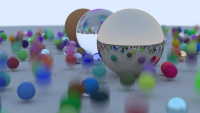

# 2 动态模糊
当你决定使用光线追踪时，你认为视觉质量比运行时间更重要。在渲染模糊反射和散焦模糊时，我们对每个像素进行多次采样。一旦你踏上这条路，好消息是几乎所有效果都可以用类似的方法强制实现。运动模糊当然是其中之一。

在真实的相机中，快门会在短时间内保持打开状态，在此期间，相机和世界上的物体可能会移动。为了准确再现这样的相机镜头，我们寻求相机在快门打开时的平均感测值。

## 2.1 时空光线追踪简介

想象用相机拍摄运动中的物体。我们可以这样简化计算：
在快门打开的期间，随机选择一个瞬间，只计算这个瞬间的光线路径。只要我们知道那一刻每个物体的准确位置，就能准确计算出这条光线的颜色值。

虽然每次只计算一条随机光线看起来很"粗暴"，但通过成千上万次这样的随机采样，最终组合起来就能得到逼真的图像。这就是蒙特卡洛光线追踪的聪明之处——用大量随机样本逼近真实效果。

为了实现这一点，程序需要记录每条光线对应的具体时间点，这样才能正确计算当时所有物体的位置。虽然听起来简单，但正是这种'暴力'的重复计算，最终能产生非常真实的效果：
#### ray.h

```c++  {highlight=[5-6,10,14] .line-numbers}

class ray
{
public:
    ray();
    ray(const point3& origin, const vec3& direction,double time);
    ray(const point3& origin, const vec3& direction);
    const point3 GetOrigin() const;
    const vec3 GetDirection() const;
    point3 at(double t)  const;  
    double time() const;
private:
    point3 orig;
    vec3 dir;
    double tm;
    
};
```
#### ray.cpp
```c++  {highlight=[7-8,10-11,25-27] .line-numbers}

#pragma once 

#include "ray.h"

ray::ray(){}

ray::ray(const point3& origin, const vec3& direction)
    :orig(origin),dir(direction),tm(0){}

ray::ray(const point3& origin, const vec3& direction, double time)
    :orig(origin),dir(direction),tm(time){}

const vec3 ray::GetDirection() const {
        return dir;
}

const point3 ray::GetOrigin() const {
    return orig;
}

point3 ray::at(double t) const{
    return orig + t*dir;
}

double ray::time() const {
    return tm;
}
```

## 2.2 时间管理

在继续之前，让我们思考时间概念，以及如何在一帧或多帧连续渲染中管理时间。快门时间涉及两个关键维度：相邻两次快门开启的时间间隔（帧间隔），以及每帧画面快门保持开启的持续时间（曝光时间）。传统电影胶片采用每秒24帧的拍摄标准，而现代数字电影可根据导演需求选择24、30、48、60、120或任意帧率。

每帧画面均可独立设置快门速度——这个速度通常不等于（事实上往往小于）单帧的总时长。例如可以选择每帧曝光1/1000秒，或是1/60秒。

要渲染图像序列，需为相机配置三项关键参数：帧间隔时间、单帧曝光/渲染时长，以及总帧数（即镜头总时长）。当相机运动而场景静止时，直接渲染即可。但若场景中存在运动物体，则需为所有可碰撞对象添加时间感知接口，使每个物体能获取当前帧的时间区间。该接口将为动态物体提供设置本帧运动状态的途径。

这种实现方式直观明了，也非常适合作为趣味实验项目。不过为简化当前模型，我们将采用更基础的方案：仅渲染单帧画面，并默认时间轴从t=0开始到t=1结束。首要任务是改造相机系统，使其发射光线时随机生成[0,1]区间内的时间戳；其次需要创建支持动态运动的球体类。

# 2.3 更新相机以模拟运动模糊

我们需要修改相机，使其能够在开始时间和结束时间之间的随机瞬间生成光线。相机是否应该记录时间间隔，还是应该在创建光线时由相机的使用者决定？当不确定时，我倾向于让构造函数复杂化以简化调用过程，因此我会让相机自行记录时间间隔，但这属于个人偏好。目前相机不需要太多改动，因为它暂时不允许移动；它只是在一段时间内发射光线。

#### camera.cpp
```c++ {highlight=[11-12] .line-numbers}
...
ray camera::get_ray (int i, int j)const
{
    auto offset = sample_square();
    auto pixel_sample = pixel00_loc
                          + ((i + offset.GetX()) * pixel_delta_u)
                          + ((j + offset.GetY()) * pixel_delta_v);

    auto ray_origin = (defocus_angle <= 0) ? center : defocus_disk_sample();
    auto ray_direction = pixel_sample - ray_origin;
    auto ray_time = random_double(); 
    return ray(ray_origin, ray_direction,ray_time);
}
...
```

# 2.4 添加移动球体

现在创建一个移动对象。我将更新球体类，使其中心从时间=0的center1线性移动到时间=1的center2。（它在该时间间隔之外无限期地继续，因此可以在任何时候进行采样。）我们将通过用3D射线替换3D中心点来实现这一点，该射线描述了时间=0时的原始位置和时间=1时到终点位置的位移。

#### sphere.h
```c++ {highlight=[4-7,12,16] .line-numbers}
class sphere : public hittable
{
public:
    //Stationary Sphere
    sphere(const point3& static_center, double radius,std::shared_ptr<material> mat);
    // Moving Sphere
    sphere(const point3& center1, const point3& center2, double radius, std::shared_ptr<material> mat);
    
    bool hit(const ray& r, interval ray_t,hit_record& rec) const override;

private:
    ray center;
    double radius;
    std::shared_ptr<material> mat;

    static void get_sphere_uv(const point3& p, double& u ,double& v);
};
```
#### sphere.cpp
```c++ {highlight=[1-5,7-14] .line-numbers}
sphere::sphere(const point3& static_center, double radius,std::shared_ptr<material> mat)
    :center(static_center,vec3(0,0,0)),radius(std::fmax(0,radius)), mat(mat){}

sphere::sphere(const point3& center1, const point3& center2, double radius, std::shared_ptr<material> mat) 
    :center(center1, center2 - center1),radius(std::fmax(0,radius)),mat(mat){}
...
void sphere::get_sphere_uv(const point3& p, double& u, double& v)
{   double pi = 3.1415926535897932385;
    auto theta = std::acos(-p.GetY());
    auto phi = std::atan2(-p.GetZ(), p.GetX()) + pi;

    u = phi / (2*pi);
    v = theta / pi;
}
```
更新后的sphere:：hit（）函数与旧的sphere：：hit函数几乎完全相同：我们现在只需要确定动画中心的当前位置：
#### sphere.cpp
```c++ {highlight=[2-3,10] .line-numbers}
bool sphere::hit(const ray& r,interval ray_t, hit_record& rec)const 
{   point3 current_center = center.at(r.time());
    vec3 oc = current_center - r.GetOrigin();
    auto a = r.GetDirection().length_squared();
    auto h = dot(r.GetDirection(), oc);
    auto c = oc.length_squared() - radius*radius;
    ...
    rec.t = root;
    rec.p = r.at(rec.t);
    vec3 outward_normal = (rec.p - current_center) / radius;
    rec.set_face_normal(r, outward_normal);
    get_sphere_uv(outward_normal, rec.u, rec.v);
    rec.mat = mat;
    return true;
} 
```

## 2.5 追踪射线与物体相交的时间

既然光线具有时间属性，我们需要更新`materialL::scatter()`方法来考虑相交时间：
#### material.cpp
```c++ {highlight=[7,16,38] .line-numbers}
...
bool lambertian::scatter(const ray& r_in, const hit_record& rec, color& attenuation, ray& scattered)
const  {
    auto scatter_direction = rec.normal + random_unit_vector();
    if (scatter_direction.near_zero())
        scatter_direction = rec.normal;
    scattered = ray(rec.p, scatter_direction, r_in.time());
    attenuation = albedo;
    return true;
}
...
bool metal::scatter(const ray& r_in, const hit_record& rec, color& attenuation, ray& scattered) const
{
    vec3 reflected = reflect(r_in.GetDirection(), rec.normal);
    reflected = unit_vector(reflected) + (fuzz* random_unit_vector());
    scattered = ray(rec.p, reflected, r_in.time());
    attenuation = albedo;
    return (dot(scattered.GetDirection(), rec.normal) > 0);
}
...
bool dielectric::scatter(const ray& r_in, const hit_record& rec, color& attenuation,ray& scattered) const
{
    attenuation = color(1.0,1.0,1.0);
    double ri = rec.front_face ? (1.0/refraction_index) : refraction_index;

    vec3 unit_direction = unit_vector(r_in.GetDirection());
    double cos_theta = std::fmin(dot(-unit_direction, rec.normal), 1.0);
    double sin_theta = std::sqrt(1.0 - cos_theta*cos_theta);

    bool cannot_refract = ri * sin_theta > 1.0;
    vec3 direction;

    if (cannot_refract || reflectance(cos_theta, ri) > random_double())
        direction = reflect(unit_direction, rec.normal);
    else
        direction = refract(unit_direction, rec.normal, ri);

    scattered = ray(rec.p, direction, r_in.time());
    return true;
}

```
## 2.6 把各个部分组合在一起

下面的代码采用上一本书末尾场景中的漫反射球体示例，并使它们在图像渲染过程中移动。每个球体从时间t=0的中心C移动到时间t=1的C+（0，r/2,0）：

#### test.cpp
```c++ {highlight=[19,20,30,31] .line-numbers}

int main() {
    hittable_list world;

    auto ground_material = make_shared<lambertian>(color(0.5, 0.5, 0.5));
    world.add(make_shared<sphere>(point3(0,-1000,0), 1000, ground_material));

    for (int a = -11; a < 11; a++) {
        for (int b = -11; b < 11; b++) {
            auto choose_mat = random_double();
            point3 center(a + 0.9*random_double(), 0.2, b + 0.9*random_double());

            if ((center - point3(4, 0.2, 0)).length() > 0.9) {
                shared_ptr<material> sphere_material;

                if (choose_mat < 0.8) {
                    // diffuse
                    auto albedo = color::random() * color::random();
                    sphere_material = make_shared<lambertian>(albedo);
                    auto center2 = center + vec3(0,random_double(0,0.5),0);
                    world.add(make_shared<sphere>(center,center2, 0.2, sphere_material));
                } else if (choose_mat < 0.95) {
                ...   
    }
    ...
    

    camera cam;

    cam.aspect_ratio      = 16.0 / 9.0;
    cam.image_width       = 400;
    cam.samples_per_pixel = 100;
    cam.max_depth         = 50;

    cam.vfov     = 20;
    cam.lookfrom = point3(13,2,3);
    cam.lookat   = point3(0,0,0);
    cam.vup      = vec3(0,1,0);

    cam.defocus_angle = 0.6;
    cam.focus_dist    = 10.0;

    cam.render(world);
}
```
最后结果如下：
