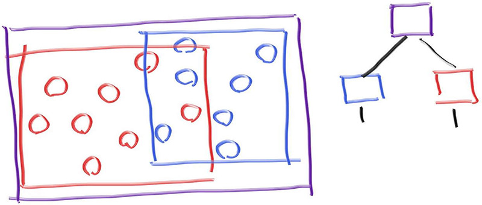
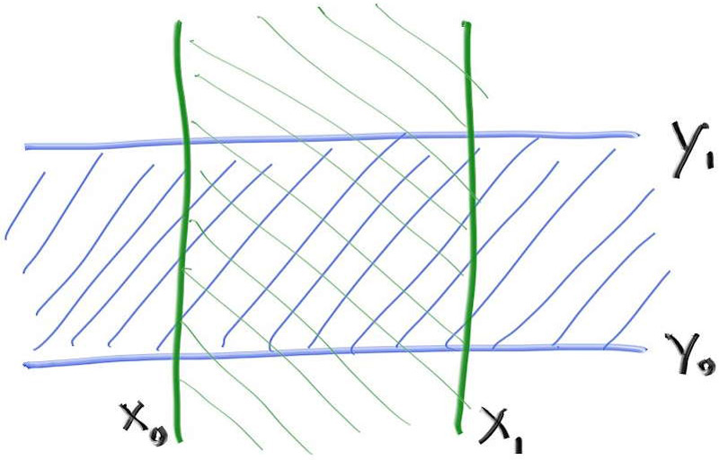
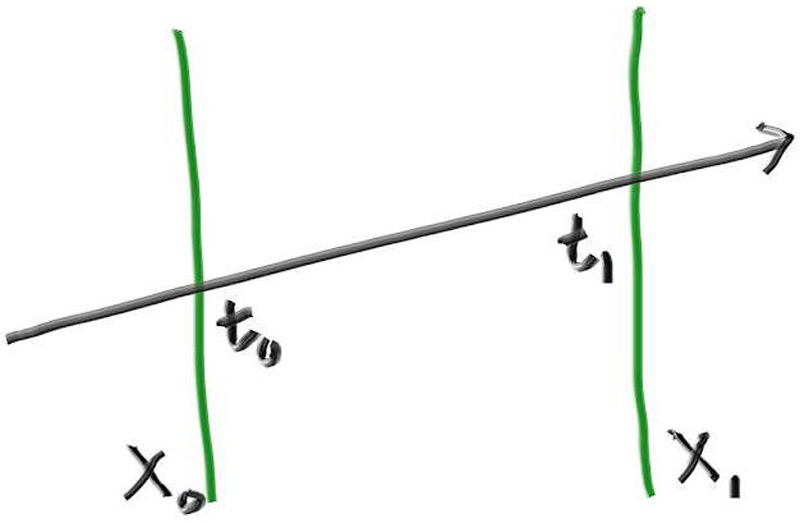
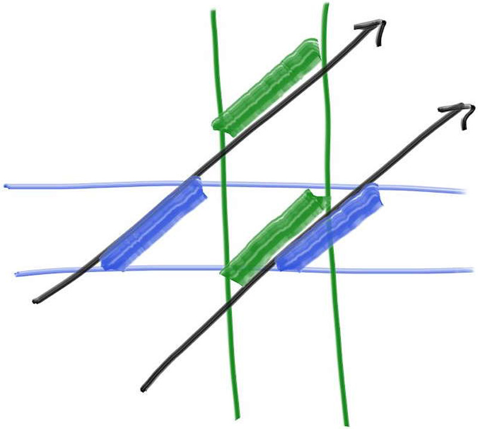

这部分是目前我们正在开发的光线追踪器中最复杂、最棘手的部分。我将其放在本章节中，一方面是为了让代码运行得更快，另一方面是因为它对`hittable`进行了小幅重构。这样当我们后续添加矩形和立方体时，就不必再回头重构这些内容。

在光线追踪器中，光线与物体的相交检测是主要的时间瓶颈，其运行时间与物体数量呈线性关系。但由于我们是在同一场景中反复进行搜索，理论上应该能实现类似二分查找的对数级搜索效率。考虑到我们需要向同一场景投射数百万乃至数十亿条光线，可以先对场景中的物体进行排序，这样每条光线的相交检测就能实现次线性搜索。最常见的两种排序方法是：1) 空间细分法 2) 对象细分法。后者通常更易于编码实现，且对大多数模型来说运行效率同样出色。

# 3.1 核心思想
为一组图元创建包围体的核心思想是找到一个完全包围（bound）所有对象的体积。例如，假设你计算了一个包围10个物体的球体。任何错过该包围球体的射线必定会错过内部的所有十个物体。如果射线击中了包围球体，那么它可能会击中十个物体中的一个。因此，包围代码通常采用以下形式
```c++
if (ray hits bounding object)
    return whether ray hits bounded objects
else
    return false
```
请注意，我们将使用这些包围体将场景中的对象分组为子群组。我们并非划分屏幕或场景空间。虽然包围体之间可以相互重叠，但每个对象必须仅归属于一个包围体内。

# 3.2 基于包围盒的层级结构

为了使计算复杂度低于线性，我们需要构建层次化的包围盒。例如，若将一组物体划分为红蓝两个子集并采用矩形包围体，则会出现以下结构：

*图1: 包围盒层级结构*
请注意，蓝色和红色边界体积包含在紫色边界体积中，但它们可能会重叠，并且没有顺序——它们都在内部。因此，右侧显示的树没有左右子级排序的概念；他们只是在里面。代码为：
```c++
if (hits purple)
    hit0 = hits blue enclosed objects
    hit1 = hits red enclosed objects
    if (hit0 or hit1)
        return true and info of closer hit
return false
```
# 3.3 轴对齐包围盒（AABBs）

为了实现高效划分（而非低效划分），我们需要一种方法将光线与包围体进行相交测试。光线与包围体的相交测试必须快速，且包围体本身需要尽可能紧凑。在实际应用中，对于大多数模型而言，轴对齐包围盒的表现优于其他方案（例如上文提到的球形包围体），但若遇到其他类型的包围模型时，这一设计选择仍需审慎考量。

从现在起，我们将轴对齐的矩形平行六面体包围体（严格来说，精确称谓确实如此）简称为轴对齐包围盒或AABB（代码中也可能用缩写"bbox"表示）。无论采用何种方法实现光线与AABB的相交测试均可，我们仅需确认是否发生碰撞，无需获取碰撞点、法线等用于物体渲染的附加信息。

多数开发者采用"slab"（平板）法进行测试。该方法基于以下原理：n维AABB本质上是n个轴对齐区间的交集，这些区间通常称为"slabs"。需注意，区间即两个端点之间的所有点，例如满足3≤x≤5的x值，或更简洁地记为x∈[3,5]。在二维空间中，AABB（矩形）由两个区间的重叠区域定义：

*图2: 2D轴对齐包围盒*
要判断一条射线是否命中一个区间，我们首先需要确定这条射线是否与边界相交。例如，在一维情况下，射线与两个平面的相交会得到射线参数 t0 和 t1。（如果射线与平面平行，则其与任何平面的交点都将未定义。）

*图3: 光线-平板相交*
如何求射线与平面的交点？记住，射线仅由一个函数定义——给定参数t，该函数返回位置P(t)：
\[
P(t) = Q + t \cdot d
\]
该方程适用于x/y/z三个坐标。例如，$x_0 = Q_x + t_0 d_x$。当参数t满足以下方程时，该射线会击中平面$x=x_0$：
$$
x_0 = Q_x + t_0 d_x
$$
因此，在交叉点处的t值为
$$ t_0 = \frac{x_0 - Q_x}{d_x} $$
我们得到关于x1的类似表达式:
$$ t_1 = \frac{x_1 - Q_x}{d_x} $$

将一维数学转化为二维或三维碰撞检测的关键观察点是：如果射线与由所有平面对构成的边界框相交，那么所有t区间都会重叠。例如在二维情况下，只有当射线与有界框相交时，绿色和蓝色的区间才会出现重叠:

*图4: 光线-平板t区间重叠*

在此图中，上方射线的区间没有重叠，因此我们可判定该射线未击中由绿色和蓝色平面界定的二维矩形框。而下方射线的区间存在重叠，故可确定该射线击中了这个有界矩形框。

## 3.4 
以下伪代码用于判断平板中的第t个区间是否存在重叠：
```c++
interval_x ← compute_intersection_x (ray, x0, x1)
interval_y ← compute_intersection_y (ray, y0, y1)
return overlaps(interval_x, interval_y)
```
这简直简单得令人惊叹，而三维版本能轻松扩展上述方法正是人们钟爱平板法（slab method）的原因:
```c++
interval_x ← compute_intersection_x (ray, x0, x1)
interval_y ← compute_intersection_y (ray, y0, y1)
interval_z ← compute_intersection_z (ray, z0, z1)
return overlaps(interval_x, interval_y, interval_z)
```
有一些注意事项使得这并不像初看起来那么美好。让我们再次考虑关于t0和t1的一维方程:
$$ t_0 = \frac{x_0 - Q_x}{d_x} $$
$$ t_1 = \frac{x_1 - Q_x}{d_x} $$
首先，假设光线沿负x方向传播。如上所述计算的时间间隔($t_{x0}$,$t_{x1}$)可能会颠倒，例如(7,3)。其次，分母$d_x$可能为零，导致无限大的值。此外，如果光线原点位于某个边界平面上，由于分子和分母都为零，可能会得到NaN（非数值）。在使用IEEE浮点数时，零值还会带有正负符号。
当$d_x = 0$时，tx0 和 tx1 也将相等：如果不在 x0 和 x1 之间，则两者均为 +∞ 或 -∞.因此，使用 min 和 max 应该能得到正确答案：
$$ t_{x0} = \min\left(\frac{x_0 - Q_x}{d_x}, \frac{x_1 - Q_x}{d_x}\right) $$
$$ t_{x1} = \max\left(\frac{x_0 - Q_x}{d_x}, \frac{x_1 - Q_x}{d_x}\right) $$

如果我们这样做，剩下的棘手情况是当$d_x=0$且$x_0−Q_x=0$或$x_1−Q_x=0$时，会导致NaN结果。这种情况下我们可以任意将其解释为命中或未命中，但稍后会重新讨论这个问题。

现在来看伪函数重叠检测。假设我们可以确保区间未发生反转，并希望在区间重叠时返回true。布尔型`overlaps()`函数通过计算t区间`t_interval1`和`t_interval2`的重叠部分，并判断该重叠是否非空来实现：
```c++
bool overlaps(t_interval1, t_interval2)
    t_min ← max(t_interval1.min, t_interval2.min)
    t_max ← min(t_interval1.max, t_interval2.max)
    return t_min < t_max
```
如果存在任何NaN值，比较操作将返回false，因此若需考虑临界接触情况（我们确实应该考虑，因为在光线追踪器中所有情况最终都会出现），就必须确保边界框留有适当裕量。

为了完成上述目标，我们首先在`interval`添加一个新的方法`expand`。该方法用来实现按给定值填充间隔：
#### interval.h
```c++ {highlight=[17] .line-numbers} 
class interval
{

public:
    interval();

    interval(double min, double max);

    double size() const;

    bool contains(double x) const;

    bool surrounds(double x) const;

    double clamp(double x) const;

    interval expand(double delta) const;
public:
    double minn,maxn;
    static const interval empty, universe;
};
```

#### interval.cpp
```c++ {highlight=[2-16] .line-numbers}
...
interval interval::expand(double delta) const
{
    auto padding = delta/2;
    return interval(min - padding, max + padding);
}
...
```

现在我们已经拥有了实现新的 AABB 类所需的一切。
#### aabb.h
```c++ {.line-numbers} 
class aabb
{
public:
    interval x, y, z;

public:
    aabb();

    aabb(const interval& x, const interval& y, const interval& z);
    
    aabb(const point3& x, const point3& y);

    const interval& axis_interval(int n)const;

    bool hit(const ray& r, interval ray_t)const;
};
```
#### aabb.cpp
```c++ {.line-numbers} 
#pragma once
#include "aabb.h"

aabb::aabb(){}

aabb::aabb(const interval& x, const interval& y, const interval& z) : x(x), y(y), z(z) {}

aabb::aabb(const point3& a, const point3& b)
{
    x = ( a[0] <= b[0] ) ? interval(a[0], b[0]) : interval(b[0], a[0]);
    y = ( a[1] <= b[1] ) ? interval(a[1], b[1]) : interval(b[1], a[1]);
    z = ( a[2] <= b[2] ) ? interval(a[2], b[2]) : interval(b[2], a[2]);
}

const interval& aabb::axis_interval(int n) const
{
    if (n == 1) return y;
    if (n == 2) return z;
    return x;
}

bool aabb::hit(const ray& r, interval ray_t) const
{   
    const point3& ray_orig = r.GetOrigin();
    const vec3& ray_dir = r.GetDirection();
    for (int i = 0; i < 3; i++) {
       const interval& ax = axis_interval(i);
       const double adinv = 1.0 / ray_dir[i];

       auto t0 = (i.minn - ray_orig[i]) * adinv;
       auto t1 = (i,maxn - ray_orig[i]) * adinv;

       if (t0 < t1)
       {
            if (t0 > ray_t.minn) ray_t.minn = t0;
            if (t1 < ray_t.maxn) ray_t.maxn = t1;
       } 
       else
       {
            if (t1 > ray_t.minn) ray_t.minn = t1;
            if (t0 < ray_t.maxn) ray_t.maxn = t0;
       }

       if (ray_t.maxn <= ray_t.minn) return false;
    }
    return true;
}
```
## 3.5 在Hittables类中构造包围盒
现在我们需要添加一个函数来计算所有可击中对象的边界框。然后，我们将为所有图元创建一个边界框层级结构，而各个图元（例如球体）将位于叶子节点上。

回想一下，默认情况下，不带参数构造的`interval`值将为空。由于aabb对象的三个维度都有一个间隔，因此默认情况下每个维度都是空的，因此aabb对象默认情况下也是空的。因此，某些对象可能具有空边界体积。例如，考虑一个没有子对象的`hittable_list`对象。幸运的是，我们设计的`intervel`类使所有数学计算都能顺利进行。

最后，请注意某些对象可能是动态的。这类对象应返回其在完整运动范围内的边界，即从时间=0到时间=1之间的全部位置边界。

#### hittable.h
```c++ {highlight=[2,11] .line-numbers}
#include "aabb.h"
class material;
...
class hittable
{
public:
    virtual ~hittable() = default;

    virtual bool hit(const ray& r, interval ray_t, hit_record& rec) const = 0;

    virtual aabb bounding_box() const = 0;
};
```
对于静止球体，bounding_box函数很简单：
#### sphere.h
```c++ {highlight=[5,7,13] .line-numbers}
class sphere : public hittable
{
public:
    //Stationary Sphere
    sphere(const point3& static_center, double radius,std::shared_ptr<material> mat);
    ...
    aabb bounding_box() const override;
    
private:
    ray center;
    double radius;
    std::shared_ptr<material> mat;
    aabb bbox;
    ...
};
```
#### sphere.cpp
```c++ {highlight=[] .line-numbers}
sphere::sphere(const point3& static_center, double radius,std::shared_ptr<material> mat)
    :center(static_center,vec3(0,0,0)),radius(std::fmax(0,radius)), mat(mat)
{
    auto rvec = vec3(radius, radius, radius);
    bbox = aabb(static_center - rvec, static_center + rvec);
}
...
aabb sphere::bounding_box() const
{
    return bbox;
}

```
对于一个运动的球体，我们想要它的整个运动范围的边界。为此，我们可以取时间=0时的球体的长方体和时间=1时的球体长方体，并计算这两个长方体周围的长方体。

#### sphere.cpp
```c++ {highlight=[4-7] .line-numbers}
...
sphere::sphere(const point3& center1, const point3& center2, double radius, std::shared_ptr<material> mat) 
    :center(center1, center2 - center1),radius(std::fmax(0,radius)),mat(mat)
{
    auto rvec = vec3(radius, radius, radius);
    aabb box1(center.at(0) - rvec, center.at(0) + rvec);
    aabb box2(center.at(1) - rvec, center.at(1) + rvec);
    bbox = aabb(box1, box2);
}
...
```
现在，我们可以使用它从两个输入框构建一个轴对齐的边界框。
#### aabb.cpp
```c++ {highlight=[] .line-numbers}
...
aabb::aabb(const aabb& box0, const aabb& box1)
{
    x = interval(box0.x, box1.x);
    y = interval(box0.y, box1.y);
    z = interval(box0.z, box1.z);
}
...
```
## 3.6 创建对象列表的边界框
现在，我们将更新hittable_list对象，计算其子对象的边界。我们将在添加每个新子对象时逐步更新边界框。
#### hittable_list.h
```c++ {highlight=[1,16,17-18] .line-numbers}
#include "aabb.h"
...
class hittable_list: public hittable
{
public:
    std::vector<shared_ptr<hittable>> objects;

public:
    hittable_list();
    hittable_list(shared_ptr<hittable> object);

    void clear();
    void add(shared_ptr<hittable> object);

    bool hit(const ray& r, interval ray_t, hit_record& rec) const  override;
    aabb bounding_box() const override;
private:
    aabb bbox;
};        
```
#### hittable_list.cpp
```c++ {highlight=[1,16,17-18] .line-numbers}
...
void hittable_list::add(shared_ptr<hittable> object)
{
    objects.push_back(object);
    bbox = aabb(bbox, object->bounding_box());
}
...
aabb hittable_list::bounding_box() const
{
    return bbox;
}

```
## 3.7 BVH 节点类
BVH（层次包围盒）同样属于`hittable`——就像`hittable`一样。它本质上是一个容器，但能够响应"这条光线是否与你相交"的查询。一个设计上的问题是：我们该采用两个类（一个用于树结构，一个用于树节点），还是只用一个类并将根节点作为我们指向的普通节点。命中函数的逻辑相当直接：先检查节点的包围盒是否被击中，若是，则检查子节点并处理相关细节。

我个人倾向于在可行时采用单一类设计。以下是该类的实现：：
#### bvh.h
```c++ {highlight=[] .line-numbers}
#pragma once
#include "aabb.h"
#include "hittable.h"
#include "hittable_list.h"


class bvh_node : public hittable
{
public:
    bvh_node(hittable_list list);
    bvh_node(std::vector<shared_ptr<hittable>>& objects, size_t start, size_t end);
    

    bool hit(const ray& r, interval ray_t, hit_record& rec) const override;
    aabb bounding_box() const override;

private:
    shared_ptr<hittable> left;
    shared_ptr<hittable> right;
    aabb bbox;
};
```
#### bvh.cpp
```c++ {highlight=[] .line-numbers}
#pragma once
#include "bvh.h"
#include <algorithm>
bvh_node::bvh_node(hittable_list list):bvh_node(list.objects,0,list.objects.size()){}

bvh_node::bvh_node(std::vector<shared_ptr<hittable>>& objects, size_t start, size_t end)
{
     // To be implemented later.
}

bool bvh_node::hit(const ray& r, interval ray_t, hit_record& rec) const
{
    if (!bbox.hit(r, ray_t))
        return false;

    bool hit_left = left->hit(r, ray_t, rec);
    bool hit_right = right->hit(r, ray_t, rec);

    return hit_left || hit_right;
}

aabb bvh_node::bounding_box() const
{
    return bbox;
}   

```
## 3.8 拆分BVH
任何效率结构（包括BVH）中最复杂的部分就是构建它。我们在构造函数中完成这一过程。BVH的一个巧妙之处在于，只要将bvh_node中的对象列表划分为两个子列表，命中函数就能正常工作。如果划分得当，效果会最好——这样两个子节点的包围盒会比父节点的小，但这关乎速度而非正确性。我选择折中方案，在每个节点沿一个轴分割列表。为求简洁，我采用以下方式：

1.随机选择一个轴
2.对图元排序（使用`std::sort`）
3.将半数放入每个子树

当传入列表只有两个元素时，我会在每个子树中各放一个并结束递归。遍历算法应当流畅运行且无需检查空指针，因此若只有一个元素，我会在两个子树中复制它。显式检查三个元素并仅进行一次递归可能会略有帮助，但我认为整个方法后续会进行优化。以下代码使用了三个尚未定义的方法：`box_x_compare`、`box_y_compare`和`box_z_compare`。
#### bvh.cpp
```c++ {highlight=[] .line-numbers}
...
bvh_node::bvh_node(std::vector<shared_ptr<hittable>>& objects, size_t start, size_t end)
{
    int axis = random_int(0,2);

    auto comparator = (axis == 0 ? box_x_compare :
                      axis == 1 ? box_y_compare :
                                  box_z_compare);
    
    size_t object_span = end - start;

    if (object_span == 1) {
        left = right = objects[start];
    } else if (object_span == 2) {
        if (comparator(objects[start], objects[start + 1])) {
            left = objects[start];
            right = objects[start + 1];
        } else {
            left = objects[start + 1];
            right = objects[start];
        }
    } else {
        std::sort(objects.begin() + start, objects.begin() + end, comparator);
        size_t mid = start + object_span / 2;
        left = std::make_shared<bvh_node>(objects, start, mid);
        right = std::make_shared<bvh_node>(objects, mid, end);
    }

    bbox = aabb(left->bounding_box(), right->bounding_box());
}
...
```
#### rtweekend.h
```c++ {highlight=[7-10] .line-numbers}
...
inline double random_double(double min, double max)
{
    return min + (max - min) * random_double();
}

inline int random_int(int min, int max)
{
    return static_cast<int>(random_double(min, max + 1));
}
...
```
检查是否存在包围盒是为了应对传入类似无限平面这种没有包围盒的情况。我们目前没有任何此类基础图元，因此在您添加这类对象之前，这种情况不应该发生。

## 3.9 比较函数
现在我们需要实现`std::sort()`使用的比较函数。为此，创建一个通用比较器，如果给定额外的轴索引参数，第一个参数小于第二个参数，则返回true。然后定义使用通用比较函数的轴特定比较函数。
#### bvh.h
```c++ {highlight=[6-12] .line-numbers}
private:
    shared_ptr<hittable> left;
    shared_ptr<hittable> right;
    aabb bbox;

    static bool box_compare(const shared_ptr<hittable>& a, const shared_ptr<hittable>& b, int axis_index);

    static bool box_x_compare(const shared_ptr<hittable>& a, const shared_ptr<hittable>& b);

    static bool box_y_compare(const shared_ptr<hittable>& a, const shared_ptr<hittable>& b);

    static bool box_z_compare(const shared_ptr<hittable>& a, const shared_ptr<hittable>& b);
```
#### bvh.cpp
```c++ {highlight=[] .line-numbers}
...
bool bvh_node::box_compare(const shared_ptr<hittable>& a, const shared_ptr<hittable>& b, int axis_index)
{   auto a_axis_interval = a->bounding_box().axis_interval(axis_index);
    auto b_axis_interval = b->bounding_box().axis_interval(axis_index);
    return a_axis_interval.minn < b_axis_interval.minn;
}

bool bvh_node::box_x_compare(const shared_ptr<hittable>& a, const shared_ptr<hittable>& b)
{
    return box_compare(a, b, 0);
}

bool bvh_node::box_y_compare(const shared_ptr<hittable>& a, const shared_ptr<hittable>& b)
{
    return box_compare(a, b, 1);
}

bool bvh_node::box_z_compare(const shared_ptr<hittable>& a, const shared_ptr<hittable>& b)
{
    return box_compare(a, b, 2);
}
```
#### test.cpp
```c++ {highlight=[1,11] .line-numbers}
#include "bvh.h"
#include "camera.h"
#include <limits>

int main()
{
...
    auto material3 = make_shared<metal>(color(0.7, 0.6, 0.5), 0.0);
    world.add(make_shared<sphere>(point3(4, 1, 0), 1.0, material3));

    world = hittable_list(make_shared<bvh_node>(world));

    camera cam;
...
}
```
渲染图像应与图像1中显示的非BVH版本相同。但是，如果您对这两个版本进行计时，BVH版本应该更快。我看到速度几乎是前一版本的6.5倍。
## 3.10 BVH优化
我们可以进一步加速BVH的优化。与其随机选择分割轴，不如沿包围盒的最长轴进行分割以获得最佳细分效果。这个改动虽然直接，但过程中我们需要为aabb类添加一些功能。

首先需要在BVH构造函数中构建物体集合的轴向包围盒。具体来说，我们将通过初始化一个空包围盒（稍后会定义aabb::empty方法），然后逐个扩展该包围盒以包含物体集合中所有对象的包围盒，从而构建bvh_node的包围盒。

获取包围盒后，将分割轴设置为最长边所在的轴。这里假设我们有一个辅助函数`aabb::longest_axis()`来实现这个功能。最后，由于我们预先计算了物体集合的包围盒，可以删除原本通过左右子树包围盒并集来计算该包围盒的那行代码。
#### bvh.h
```c++ {highlight=[3-7,31] .line-numbers}
bvh_node::bvh_node(std::vector<shared_ptr<hittable>>& objects, size_t start, size_t end)
{
    bbox = aabb::empty;
    for (size_t object_index=start; object_index < end; object_index++)
        bbox = aabb(bbox, objects[object_index]->bounding_box());

    int axis = bbox.longest_axis();

    auto comparator = (axis == 0 ? box_x_compare :
                      axis == 1 ? box_y_compare :
                                  box_z_compare);
    
    size_t object_span = end - start;

    if (object_span == 1) {
        left = right = objects[start];
    } else if (object_span == 2) {
        if (comparator(objects[start], objects[start + 1])) {
            left = objects[start];
            right = objects[start + 1];
        } else {
            left = objects[start + 1];
            right = objects[start];
        }
    } else {
        std::sort(objects.begin() + start, objects.begin() + end, comparator);
        size_t mid = start + object_span / 2;
        left = std::make_shared<bvh_node>(objects, start, mid);
        right = std::make_shared<bvh_node>(objects, mid, end);
    }

}
```
#### aabb.h
```c++ {highlight=[19,21,22] .line-numbers}
class aabb
{
public:
    interval x, y, z;

public:
    aabb();

    aabb(const interval& x, const interval& y, const interval& z);
    
    aabb(const point3& x, const point3& y);

    aabb(const aabb& a, const aabb& b);

    const interval& axis_interval(int n)const;

    bool hit(const ray& r, interval ray_t)const;

    int longest_axis() const;

    static const aabb empty;
    static const aabb universe;
};
```
#### aabb.cpp
```c++ {highlight=[] .line-numbers}
...
int aabb::longest_axis() const
{
    if (x.size() > y.size()) 
        return x.size() > z.size() ? 0:2;
    else
        return y.size() > z.size() ? 1:2;    
}

const aabb aabb::empty    = aabb(interval::empty,    interval::empty,    interval::empty);
const aabb aabb::universe = aabb(interval::universe, interval::universe, interval::universe);
...
```