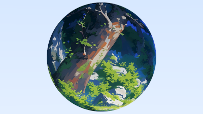

# 4纹理映射
计算机图形学中的纹理映射是将材质效果应用于场景中对象的过程。“纹理”部分是效果，“映射”部分是将一个空间映射到另一个空间的数学意义。此效果可以是任何材质属性：颜色、光泽度、凹凸几何体（称为凹凸贴图），甚至是材质存在（以创建曲面的剪切区域）。

最常见的纹理映射类型将图像映射到对象的表面上，定义对象表面上每个点的颜色。在实践中，我们反向实现该过程：给定对象上的某个点，我们将查找纹理贴图定义的颜色。

首先，我们将使纹理颜色程序化，并创建一个恒定颜色的纹理贴图。大多数程序在不同的类中保持恒定的RGB颜色和纹理，所以可以随意做一些不同的事情，但我非常相信这种架构，因为能够将任何颜色变成纹理都很棒。

为了执行纹理查找，我们需要一个纹理坐标。这个坐标可以用多种方式定义，我们将在前进的过程中发展这个想法。现在，我们将传入二维纹理坐标。按照惯例，纹理坐标被命名为u和v。对于恒定纹理，每个（u，v）对都会产生恒定的颜色，因此我们实际上可以完全忽略坐标。但是，其他纹理类型将需要这些坐标，因此我们将这些坐标保留在方法接口中。

我们纹理类的主要方法是`color value（…）`方法，它返回给定输入坐标的纹理颜色。除了获取点的纹理坐标u和v外，我们还提供了所讨论点的位置，原因稍后解释。

## 4.1 Constant Color Texture
#### texture.h
```c++ {highlight=[] .line-numbers}
#include "color.h"
class texture
{
public:
    virtual ~texture() = default;

    virtual color value(double u, double v, const point3& p) const = 0;
};

class solid_color : public texture
{
public:
    solid_color(const color& albedo) ;

    solid_color(double red ,double green, double blue);

    color value(double u ,double v, const point3& p) const override;

private:
    color albedo;
};
```

#### texture.cpp
```c++ {highlight=[] .line-numbers}
#pragma once 
#include "texture.h"

solid_color::solid_color(const color& albedo) : albedo(albedo) {}

solid_color::solid_color(double red ,double green, double blue) : solid_color(color(red, green, blue)) {}

color value(double u ,double v, const point3& p) const
{
    return albedo;
}
```
我们需要更新hit_record来存储射线对象撞击点的u、v曲面坐标。
#### hittable.h
```c++ {highlight=[8,9] .line-numbers}
class hit_record
{
public:
    point3 p;
    vec3 normal;
    std::shared_ptr<material> mat;
    double t;
    double u;
    double v;
    bool front_face;
    ...
};
```

将来，我们需要计算每种类型的`hittable`上给定点的（u，v）纹理坐标。稍后将详细介绍。

## 4.2 实体纹理：棋盘格纹理
实体（或空间）纹理仅取决于3D空间中每个点的位置。你可以把一个实心纹理想象成它正在为空间中的所有点着色，而不是为该空间中的给定对象着色。因此，当对象改变位置时，它可以在纹理的颜色中移动，尽管通常你会修复对象和实体纹理之间的关系。

为了探索空间纹理，我们将实现一个空间checker_texture类，该类实现了一个三维检查器模式。由于空间checker函数是由空间中的给定位置驱动的，因此texture value（）函数忽略u和v参数，只使用p参数。

为了实现棋盘图案，我们首先需要计算输入点各分量的整数部分值（floor值）。虽然我们可以直接截断坐标值，但这会将数值向零方向取整，导致零值两侧显示相同颜色。而使用floor函数会始终将数值向左取整（朝向负无穷方向）。得到这三个整数结果（⌊x⌋, ⌊y⌋, ⌊z⌋）后，我们将它们求和并对结果取模二（即计算除以2的余数），这样可以得到0或1。最终，0对应偶数色块，1对应奇数色块。

最后，我们为纹理添加缩放因子，这样就能通过调整数值来控制场景中棋盘格图案的尺寸。具体实现时，将输入点坐标的每个分量先除以缩放因子再进行floor运算，缩放因子越大（如s=5），棋盘格会显得越密集；缩放因子越小（如s=0.2），棋盘格则会呈现更大块的色块形态。这种数学处理让棋盘格尺寸的动态调控变得直观且高效。
#### texture.h
```c++ {highlight=[] .line-numbers}
class checker_texture:public texture
{
public:
    checker_texture(double scale, std::shared_ptr<texture> even, std::shared_ptr<texture> odd);

    checker_texture(double scale, const color& c1, const color& c2);

    color value(double u, double v, const point3& p) const override;

private:
    double inv_scale;
    std::shared_ptr<texture> even;
    std::shared_ptr<texture> odd;
};
```
#### texture.cpp
```c++ {highlight=[] .line-numbers}
checker_texture::checker_texture(double scale, std::shared_ptr<texture> even, std::shared_ptr<texture> odd) : inv_scale(1.0/scale), even(even), odd(odd) {}

checker_texture::checker_texture(double scale, const color& c1, const color& c2) : checker_texture(scale, std::make_shared<solid_color>(c1), std::make_shared<solid_color>(c2)) {}

color checker_texture::value(double u, double v, const point3& p) const
{
   auto xInteger = int(std::floor(inv_scale * p.GetX()));
   auto yInteger = int(std::floor(inv_scale * p.GetY()));
   auto zInteger = int(std::floor(inv_scale * p.GetZ()));

   bool isEven = (xInteger + yInteger + zInteger) % 2 == 0;
   return isEven ? even->value(u,v,p): odd->value(u,v,p);
}
```
棋盘格的奇偶参数（odd/even）既可以指向固定颜色的常量纹理，也可以关联到其他程序化生成的动态纹理。这种设计理念源自 Pat Hanrahan 在 20 世纪 80 年代提出的着色器网络（Shader Networks）架构思想。

为了支持程序化纹理，我们需要对原有的`Lambertian`材质类进行扩展，使其能够处理纹理输入而非单一颜色：
#### material.h
```c++ {highlight=[3,4,9] .line-numbers}
class lambertian : public material {
    public:
      lambertian(const color& albedo);
      lambertian(std::shared_ptr<texture> tex); 

      bool scatter(const ray& r_in, const hit_record& rec, color& attenuation, ray& scattered) const override;
  
    private:
      std::shared_ptr<texture> tex;
};
```
#### material.cpp
```c++ {highlight=[1,2,10] .line-numbers}
lambertian::lambertian(const color& albedo) : tex(make_shared<solid_color>(albedo)){}
lambertian::lambertian(std::shared_ptr<texture>tex) : tex(tex) {}

bool lambertian::scatter(const ray& r_in, const hit_record& rec, color& attenuation, ray& scattered)
const  {
    auto scatter_direction = rec.normal + random_unit_vector();
    if (scatter_direction.near_zero())
        scatter_direction = rec.normal;
    scattered = ray(rec.p, scatter_direction, r_in.time());
    attenuation = tex->value(rec.u,rec.v,rec.p);
    return true;
}
```
如果我们将其添加到我们的main函数中：
#### test.cpp
```c++ {highlight=[2,7,8] .line-numbers}
...
#include "texture.h"

int main() {
    hittable_list world;

    auto checker = std::make_shared<checker_texture>(0.32, color(.2, .3, .1), color(.9, .9, .9));
    world.add(std::make_shared<sphere>(point3(0,-1000,0), 1000, std::make_shared<lambertian>(checker)));

    for (int a = -11; a < 11; a++) {
    ...    
}        
```
结果如下

# 4.3 渲染实体棋盘纹理
我们将为程序添加第二个场景，并随着本书的进展逐步加入更多场景。为此，我们将设置一个switch语句来选择当前运行所需的场景。这种方法虽然简陋，但我们的目标是保持极简，专注于光线追踪的核心实现。在您自己的光线追踪器中，您可能需要采用不同的方式（例如支持命令行参数）。

以下是重构后的main.cc文件（针对随机球体场景的实现）。将原main()函数重命名为`bouncing_spheres()`，并新建一个main()函数来调用它：
#### test.cpp
```c++ {highlight=[] .line-numbers}
...
void bouncing_spheres() {
    ...
} 
int main() {
    bouncing_spheres();
}   
```

#### test.cpp
```c++ {highlight=[] .line-numbers}
void bouncing_spheres() {
    ...
} 

void checkered_spheres() {
    hittable_list world;

    auto checker = make_shared<checker_texture>(0.32, color(.2, .3, .1), color(.9, .9, .9));

    world.add(make_shared<sphere>(point3(0,-10, 0), 10, make_shared<lambertian>(checker)));
    world.add(make_shared<sphere>(point3(0, 10, 0), 10, make_shared<lambertian>(checker)));

    camera cam;

    cam.aspect_ratio      = 16.0 / 9.0;
    cam.image_width       = 400;
    cam.samples_per_pixel = 100;
    cam.max_depth         = 50;

    cam.vfov     = 20;
    cam.lookfrom = point3(13,2,3);
    cam.lookat   = point3(0,0,0);
    cam.vup      = vec3(0,1,0);

    cam.defocus_angle = 0;

    cam.render(world);
}
int main() {
     switch (2) {
        case 1: bouncing_spheres();  break;
        case 2: checkered_spheres(); break;
    }
}   
```
结果如下

你可能会觉得这个结果看起来有点奇怪。由于棋盘格纹理是一种空间纹理，我们实际上看到的是球体表面与三维棋盘格空间相交的效果。在很多情况下，这种效果非常完美，或者至少已经足够。但在其他许多情况下，我们更希望能在物体表面获得一致的纹理效果。接下来我们将介绍实现这种效果的方法。

## 4.4 Texture Coordinates for Spheres
常色纹理不使用坐标。实体纹理（或空间纹理）使用空间点的坐标。现在该利用u、v纹理坐标了——这些坐标指定了二维源图像（或某个二维参数化空间）中的位置。为此，我们需要找到一种方法来确定三维物体表面任意点的u、v坐标。这种映射完全可自定义，但通常需要覆盖整个表面，并能以合理方式对二维图像进行缩放、定向和拉伸。我们将从推导球面的u、v坐标方案开始。

对于球体，纹理坐标通常基于某种形式的经度和纬度，即球面坐标。因此我们计算球面坐标系中的(θ,ϕ)，其中θ是从底部极点(即从-Y方向向上)的角度，ϕ是绕Y轴旋转的角度(从-X到+Z到+X到-Z再回到-X)。

我们需要将θ和ϕ映射到[0,1]范围内的纹理坐标u和v，其中(u=0,v=0)对应纹理的左下角。因此，从(θ,ϕ)到(u,v)的标准化转换公式为：

u = ϕ/(2π)
v = θ/π

要计算原点为中心的单位球面上某点的θ和ϕ，我们从对应的笛卡尔坐标方程出发：

y = -cos(θ)
x = -cos(ϕ)sin(θ)
z = sin(ϕ)sin(θ)

需要通过反解这些方程来求θ和ϕ。借助<cmath>库中的std::atan2()函数——该函数接收与正弦和余弦成比例的任意两个数并返回对应角度——我们可以传入x和z（sin(θ)项会被抵消）来求解ϕ：

ϕ = atan2(z, -x)

std::atan2()的返回值范围是-π到π，其变化规律是：从0递增到π，然后跳转到-π再回到0。虽然数学上正确，但我们需要u的范围是0到1，而非0到1/2再转到-1/2到0。幸运的是存在以下关系：

atan2(a,b) = atan2(-a,-b) + π

第二种表达式能产生从0连续递增到2π的值。因此我们可改进ϕ的计算式为：

ϕ = atan2(-z, x) + π

θ的推导更为直接：

θ = arccos(-y)

因此对于单位球面，(u,v)坐标可通过以下工具函数计算，该函数接收原点为中心的单位球面上的点，并返回对应的u和v值：
#### sphere.cpp
```c++ {highlight=[] .line-numbers}
...
void sphere::get_sphere_uv(const point3& p, double& u, double& v)
{   // p: a given point on the sphere of radius one, centered at the origin.
    // u: returned value [0,1] of angle around the Y axis from X=-1.
    // v: returned value [0,1] of angle from Y=-1 to Y=+1.
    //     <1 0 0> yields <0.50 0.50>       <-1  0  0> yields <0.00 0.50>
    //     <0 1 0> yields <0.50 1.00>       < 0 -1  0> yields <0.50 0.00>
    //     <0 0 1> yields <0.25 0.50>       < 0  0 -1> yields <0.75 0.50>
    double pi = 3.1415926535897932385;
    auto theta = std::acos(-p.GetY());
    auto phi = std::atan2(-p.GetZ(), p.GetX()) + pi;

    u = phi / (2*pi);
    v = theta / pi;
}
...
```
以下是更新后的 sphere::hit() 函数实现，添加了 UV 坐标计算功能：
#### sphere.cpp
```c++ {highlight=[7] .line-numbers}
bool sphere::hit(const ray& r,interval ray_t, hit_record& rec)const 
{   ...
    rec.t = root;
    rec.p = r.at(rec.t);
    vec3 outward_normal = (rec.p - current_center) / radius;
    rec.set_face_normal(r, outward_normal);
    get_sphere_uv(outward_normal, rec.u, rec.v);
    rec.mat = mat;
    return true;
}
```
根据碰撞点 P 计算出表面坐标 (u,v) 后，我们可以通过两种方式应用纹理：

程序化纹理：直接将 (u,v) 坐标输入solid texture程序化纹理生成算法中
图像纹理：将 (u,v) 坐标映射到二维图像上
传统直接取整方法（将 u,v 舍入为整数作为像素坐标 (i,j)）存在两个问题：

需要随图像分辨率修改代码
缺乏标准化规范
因此图形学领域普遍采用纹理坐标（texture coordinates）方案，其核心是使用图像的归一化位置：


u = i / (Nx - 1.0)
v = j / (Ny - 1.0)


## 4.5 Accessing Texture Image Data
现在我们需要创建一个用于存储图像的纹理类。我将使用我最喜欢的图像处理工具stb_image，它能够将图像数据读取到32位浮点值数组中。这些数据以RGB格式打包存储，每个颜色分量的取值范围为[0,1]（从纯黑到纯白）。此外，图像是以线性色彩空间（gamma=1）加载的——这正是我们进行所有计算时使用的色彩空间。

为简化图像文件加载过程，我们提供了一个辅助类rtw_image来管理这些操作。该类包含一个辅助函数pixel_data(int x, int y)，用于获取每个像素的8位RGB字节值。以下代码示例假设您已将stb_image.h头文件复制到名为external的文件夹中，请根据实际目录结构调整路径。
#### rtw_stb_image.cpp
```c++ {highlight=[] .line-numbers}
#pragma once

#define STB_IMAGE_IMPLEMENTATION
#define STBI_FAILURE_USERMSG
#include "rtw_stb_image.h"

rtw_image::rtw_image(){}

rtw_image::rtw_image(const char* image_filename)
{
    auto filename = std::string(image_filename);
    auto imagedir = getenv("RTW_IMAGES");

    if (imagedir && load(std::string(imagedir) + "/" + image_filename)) return;
    if (load(filename)) return;
    if (load("images/" + filename)) return;
    if (load("../images/" + filename)) return ;
    if (load("../../images/" + filename)) return;
    if (load("../../../images" + filename)) return;
    if (load("../../../../images" + filename)) return;
    if (load("../../../../../images" + filename)) return;
    if (load("../../../../../../images" + filename)) return;

    std::cerr << "ERROR: Could not load image file '" << image_filename << "'.\n";
}

rtw_image::~rtw_image()
{
    delete[] bdata;
    STBI_FREE(fdata);
}

bool rtw_image::load(const std::string& filename)
{
    auto n = bytes_per_pixel;
    fdata = stbi_loadf(filename.c_str(),&image_width,&image_height,&n,bytes_per_pixel);
    if ( fdata == nullptr) return false;

    bytes_per_scanline = image_width * bytes_per_pixel;
    convert_to_bytes();
    return true;
}

int rtw_image::width() const{return (fdata == nullptr) ? 0 :image_width;}

int rtw_image::height() const{return (fdata == nullptr) ? 0 : image_height;}

const unsigned char* rtw_image::pixel_data(int x,int y) const
{
    static unsigned char magenta[] = {255,0,255};
    if(bdata == nullptr) return magenta;

    x = clamp(x,0,image_width);
    y = clamp(y,0,image_height);

    return bdata + y * bytes_per_scanline + x * bytes_per_pixel;
} 

int rtw_image :: clamp(int x ,int low ,int high)
{
    if (x < low) return low;
    if (x < high) return x;
    return high - 1;
}

unsigned char rtw_image::float_to_bytes(float value)
{
    if( value <= 0.0)
        return 0;
    if(1.0 <= value)
        return 255;
    return static_cast<unsigned char>(256.0 * value);
}


void rtw_image::convert_to_bytes()
{
    int total_bytes = image_width * image_height * bytes_per_pixel;
    bdata = new unsigned char[total_bytes];

    auto *bptr = bdata;
    auto *fptr = fdata;

    for (auto i = 0;i < total_bytes;i++,fptr++,bptr++)
        *bptr = float_to_bytes(*fptr);
}
`image_texture`类使用了rtw_image类：
```
#### texture.h
```c++ {highlight=[] .line-numbers}
...
#include "rtw_stb_image.h"

...
class image_texture : public texture
{
public:
    image_texture(const char* filename);

    color value(double u , double v,const point3& p) const override;

private:
    rtw_image image;
};
```
#### texture.cpp
```c++ {highlight=[] .line-numbers}
...
image_texture::image_texture(const char* filename) : image(filename){}

color image_texture::value(double u ,double v, const point3& p) const
{
    if (image.height() <= 0) return color(0,1,1);

    u = interval(0,1).clamp(u);
    v = 1.0 - interval(0,1).clamp(v);

    auto i = int(u * image.width());
    auto j = int(v * image.height());
    auto pixel = image.pixel_data(i,j);

    auto color_scale = 1.0 /255.0;
    return color(color_scale*pixel[0],color_scale*pixel[1], color_scale* pixel[2]);
}   
...
```
## 4.6 Rendering the image texture
以下是读取图像文件并将其分配给漫反射材质的代码:
#### test.cpp
```c++ {highlight=[] .line-numbers}
...
void earth() {
    auto earth_texture = make_shared<image_texture>("earth.jpg");
    auto earth_surface = make_shared<lambertian>(earth_texture);
    auto globe = make_shared<sphere>(point3(0,0,0), 2, earth_surface);

    camera cam;

    cam.aspect_ratio      = 16.0 / 9.0;
    cam.image_width       = 400;
    cam.samples_per_pixel = 100;
    cam.max_depth         = 50;
    cam.background        = color(0.70, 0.80, 1.00);

    cam.vfov     = 20;
    cam.lookfrom = point3(0,0,12);
    cam.lookat   = point3(0,0,0);
    cam.vup      = vec3(0,1,0);

    cam.defocus_angle = 0;

    cam.render(hittable_list(globe));
}
...
```

我们开始体会到将所有颜色作为纹理处理的强大之处——可以为Lambertian材质分配任意类型的纹理，而Lambertian材质本身无需感知这些细节。

如果渲染结果中出现一个大型青色球体，则表明stb_image未能找到您的地球贴图照片。程序会在可执行文件所在目录中查找该文件。请确保将地球贴图复制到构建目录中，或者重写earth()函数以指向其他路径。

