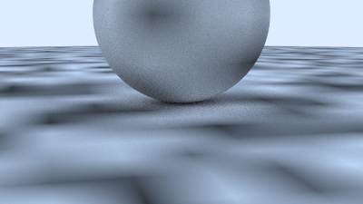
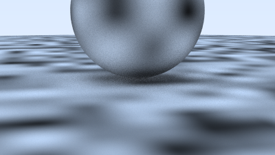
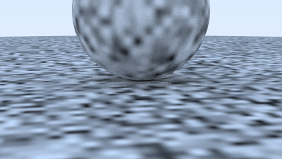
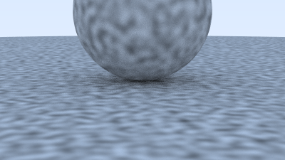
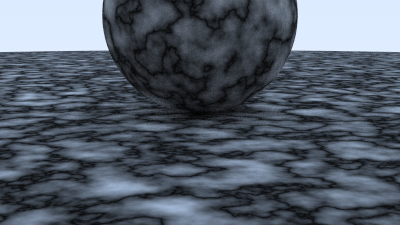
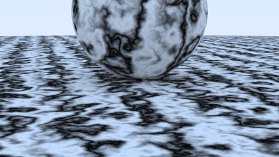

# 5 Perlin Noise
大多数开发者会使用某种形式的Perlin噪声来生成精美的实体纹理。这种噪声算法以其发明者Ken Perlin的名字命名。与下图所示的普通白噪声不同，Perlin纹理生成的并非这种随机噪点：
！[Image](../img/5.png)
Perlin噪声生成的纹理更像是经过模糊处理的白噪声:
！[Image](../img/6.png)
Perlin噪声的核心特性在于其可重复性：输入相同的三维坐标点，总会返回相同的伪随机数值。相邻坐标点会返回相近的数值。另一个关键特性是算法必须简单高效，因此通常采用取巧的实现方式。我将基于Andrew Kensler的描述，逐步构建这种实现方案。

## 5.1 Using Blocks of Random Numbers

我们可以简单地用三维随机数数组平铺整个空间，然后分块使用这些数值。但这样会产生明显的块状重复图案。
！[Image](../img/7.png)
我们可以改用哈希算法进行数值扰动，而非简单平铺。以下是实现该功能的部分辅助代码：
#### perlin.h
```c++ {highlight=[] .line-numbers}
#include "rtweekend.h"
class perlin
{
public:
    perlin();

    double noise(const point3& p) const;

private:
    static const int point_count = 256;
    double randfloat[point_count];
    int perm_x[point_count];
    int perm_y[point_count];
    int perm_z[point_count];

    static void perlin_generate_perm(int* p);

    static void permute(int* p,int n);
};
```

#### perlin.cpp
```c++ {highlight=[] .line-numbers}
perlin::perlin()
{
    for (int i=0;i<point_count;i++)
    {
        randfloat[i] = random_double();
    }

    perlin_generate_perm(perm_x);
    perlin_generate_perm(perm_y);
    perlin_generate_perm(perm_z);
}

double perlin::noise(const point3& p) const
{
    auto i = int(4*p.GetX()) & 255;
    auto j = int(4*p.GetY()) & 255;
    auto k = int(4*p.GetZ()) & 255;

    return randfloat[perm_x[i] ^ perm_y[j] ^ perm_z[k]];
}

void perlin::perlin_generate_perm(int* p)
{
    for(int i=0;i<point_count;i++)
        p[i] = i;
    
    permute(p,point_count);
}

void perlin::permute(int*p , int n)
{
    for(int i=n-1;i>0;i--)
    {
        int target = random_int(0,i);
        int temp = p[i];
        p[i] = p[target];
        p[target] = temp;
    }
}
```
现在，如果我们创建一个实际纹理，将这些0到1之间的浮点值转换为灰度颜色：


#### texture.h
```c++ {highlight=[] .line-numbers}
#include "perlin.h"
...
class noise_texture : public texture
{
public:
    noise_texture();

    color value(double u ,double v, const point3& p) const override;

private:
    perlin noise;
};
```
#### texture.cpp
```c++ {highlight=[] .line-numbers}
...
noise_texture::noise_texture(){}

color noise_texture::value(double u,double v, const point3& p) const
{
    return color(1,1,1) * noise.noise(p);
}
```

我们可以将这个纹理应用到球体上：
#### test.cpp
```c++ {highlight=[1-23,26,30] .line-numbers}
void perlin_spheres()
{
    hittable_list world;

    auto pertext = make_shared<noise_texture>();
    world.add(make_shared<sphere>(point3(0,-1000,0),1000,make_shared<lambertian>(pertext)));
    world.add(make_shared<sphere>(point3(0,2,0),2,make_shared<lambertian>(pertext)));

    camera cam;

    cam.aspect_ratio = 16.0 / 9.0;
    cam.image_width = 400;
    cam.samples_per_pixel = 100;
    cam.max_depth = 50;

    cam.vfov = 20;
    cam.lookfrom = point3(13,2,3);
    cam.lookat = point3(0,0,0);
    cam.vup = vec3(0,1,0);

    cam.defocus_angle = 0 ;
    cam.render(world);
}

int main() {
    switch (4) {
        case 1:  bouncing_spheres();   break;
        case 2:  checkered_spheres();  break;
        case 3:  earth();              break;
        case 4:  perlin_spheres();     break;
    }
}
```
而哈希算法确实如预期实现了数值扰动：
！[Image](../res/5.png)
## 5.2 优化渲染效果

为了让效果更平滑，我们可以采用线性插值的方法：
#### perlin.h
```c++ {highlight=[6] .line-numbers}
class perlin
{
...
private:
    ...
    static double trilinear_inerp(double c[2][2][2],double u,double v,double w);
};
```
#### perlin.cpp
```c++ {highlight=[] .line-numbers}
double perlin::noise(const point3& p) const
{
    auto u = p.GetX() - std::floor(p.GetX());
    auto v = p.GetY() - std::floor(p.GetY());
    auto w = p.GetZ() - std::floor(p.GetZ());
    
    auto i = int(std::floor(p.GetX()));
    auto j = int(std::floor(p.GetY()));
    auto k = int(std::floor(p.GetZ()));

    double c[2][2][2];

    for(int di = 0;di<2;di++)
        for(int dj = 0;dj < 2;dj++)
            for(int dk = 0; dk<2;dk++)
            c[di][dj][dk] = randfloat[
                perm_x[(i + di) &255] ^
                perm_y[(j + dj) &255] ^
                perm_z[(k + dk) &255] 
            ];
    
    return trilinear_inerp(c,u,v,w);
}
...
double perlin::trilinear_inerp(double c[2][2][2],double u,double v,double w)
{
    auto accum = 0.0;
    for (int i=0;i<2;i++)
        for(int j=0;j<2;j++)
         for(int k =0;k<2;k++)
           accum += (i*u + (1-i)*(1-u))
                       * (j*v + (1-j)*(1-v))
                       * (k*w + (1-k)*(1-w))
                       * c[i][j][k];
    return accum;
}

```
结果如下：

## 5.3 Hermitian Smoothing改进
线性插值确实改善了效果，但图像中仍存在明显的网格特征。部分原因是马赫带效应——这是颜色线性插值产生的常见视觉伪影。业内常规解决方案是采用Hermite cubic函数来优化插值曲线：

#### perlin.cpp
```c++ {highlight=[7-9] .line-numbers}
double perlin::noise(const point3& p) const
{
    auto u = p.GetX() - std::floor(p.GetX());
    auto v = p.GetY() - std::floor(p.GetY());
    auto w = p.GetZ() - std::floor(p.GetZ());
    
    u = u*u*(3-2*u);
    v = v*v*(3-2*v);
    w = w*w*(3-2*w);

    auto i = int(std::floor(p.GetX()));
    auto j = int(std::floor(p.GetY()));
    auto k = int(std::floor(p.GetZ()));
    ...
}
```
结果如下：

## 5.4 调整噪声频率

当前噪声频率偏低。我们可以通过缩放输入坐标点来加快变化频率：
#### texture.h
```c++ {highlight=[4,9] .line-numbers}
class noise_texture : public texture
{
public:
    noise_texture(double scale);

    color value(double u ,double v, const point3& p) const override;

private:
    perlin noise;
    double scale;
};
```
#### texture.cpp
```c++ {highlight=[2,6] .line-numbers}
...
noise_texture::noise_texture(double scale):scale(scale){}

color noise_texture::value(double u,double v, const point3& p) const
{
    return color(1,1,1) * noise.noise(scale*p);
}
```
随后将这个缩放参数添加到perlin_spheres()场景描述中：
#### test.cpp
```c++ {highlight=[4] .line-numbers}
void perlin_spheres()
{
    ...
    auto pertext = make_shared<noise_texture>(4);
    world.add(make_shared<sphere>(point3(0,-1000,0),1000,make_shared<lambertian>(pertext)));
    world.add(make_shared<sphere>(point3(0,2,0),2,make_shared<lambertian>(pertext)));

    camera cam;
    ...
}
```
结果如下：

# 5.5 在网格节点上放置随机单位向量
当前效果仍显块状，这可能是因为图案的极值点总是恰好落在整数网格坐标x/y/z上。Ken Perlin的巧妙解决方案是在网格节点上放置随机单位向量（而非单纯的浮点数），通过点积运算使极值点偏离网格位置。为此，我们首先需要将随机浮点数改为随机向量。这些向量只需保持合理的非规则方向即可，无需严格追求均匀分布：
#### perlin.h
```c++ {highlight=[6,11] .line-numbers}
class perlin
{
...
private:
    static const int point_count = 256;
    vec3 randvec[point_count];
    int perm_x[point_count];
    int perm_y[point_count];
    int perm_z[point_count];
    ...
    static double perlin_interp(const vec3 c[2][2][2],double u,double v,double w);
...
};
```

#### perlin.cpp
```c++ {highlight=[7,12,17,23,26-44] .line-numbers}
...
double perlin::noise(const point3& p) const
{
    auto u = p.GetX() - std::floor(p.GetX());
    auto v = p.GetY() - std::floor(p.GetY());
    auto w = p.GetZ() - std::floor(p.GetZ());
    

    auto i = int(std::floor(p.GetX()));
    auto j = int(std::floor(p.GetY()));
    auto k = int(std::floor(p.GetZ()));
    vec3 c[2][2][2];

    for(int di = 0;di<2;di++)
        for(int dj = 0;dj < 2;dj++)
            for(int dk = 0; dk<2;dk++)
            c[di][dj][dk] = randvec[
                perm_x[(i + di) &255] ^
                perm_y[(j + dj) &255] ^
                perm_z[(k + dk) &255] 
            ];
    
    return perlin_interp(c,u,v,w);
}
...
double perlin::perlin_interp(const vec3 c[2][2][2],double u,double v,double w)
{
    auto uu = u*u*(3-2*u);
    auto vv = v*v*(3-2*v);
    auto ww = w*w*(3-2*w);
    auto accum = 0.0;

    for(int i=0;i<2;i++)
        for(int j=0;j<2;j++)
            for(int k =0;k<2;k++)
            {
                vec3 weight_v(u-i, v-j, w-k);
                    accum += (i*uu + (1-i)*(1-uu))
                           * (j*vv + (1-j)*(1-vv))
                           * (k*ww + (1-k)*(1-ww))
                           * dot(c[i][j][k], weight_v);
                
            }
    return accum;
}
```
Perlin插值函数的输出可能包含负值，而我们的linear_to_gamma()色彩转换函数仅支持正值输入。为此，需要将输出值从原来的[-1,+1]范围重新映射到[0,1]区间。

#### texture.cpp
```c++ {highlight=[3] .line-numbers}
color noise_texture::value(double u,double v, const point3& p) const
{
    return color(1,1,1) * 0.5*(1.0+noise.noise(scale*p));
}
```
最终效果如下:

# 5.6 引入Turbulence
通常我们会使用由多频噪声叠加构成的复合噪声，这种技术被称为"Turbulence"，其本质是通过多次调用噪声函数进行叠加实现的：
#### perlin.h
```c++ {highlight=[5] .line-numbers}
class perlin
{
public:
...
 double turb(const point3& p,int depth) const;
...
}
```
#### perlin.cpp
```c++ {highlight=[] .line-numbers}
double perlin::turb(const point3 &p, int depth) const
{
    auto accum = 0.0;
    auto temp_p = p;
    auto weight = 1.0;

    for(int i=0;i<depth;i++)
    {
        accum += weight * noise(temp_p);
        weight *= 0.5;
        temp_p *= 2;
    }

    return std::fabs(accum);
}
```

#### texture.cpp
```c++ {highlight=[3] .line-numbers}
color noise_texture::value(double u,double v, const point3& p) const
{
    return color(1,1,1) * noise.turb(p,7);
}
```
直接使用turbulence会产生类似迷彩网的视觉效果：


# 5.7 调整相位参数

不过，湍流噪声通常以间接方式使用。例如程序化实体纹理的"入门示例"就是模拟大理石纹理，其核心原理是：让颜色值与正弦函数等周期性函数成正比，同时利用湍流噪声调整相位参数（即在sin(x)中偏移x值），从而形成波纹状条纹理。以下是注释掉基础噪声和湍流噪声后，用上述原理实现类大理石效果的代码：

#### texture.cpp
```c++ {highlight=[3] .line-numbers}
color noise_texture::value(double u,double v, const point3& p) const
{
    return color(.5, .5, .5) * (1 + std::sin(scale * p.z() + 10 * noise.turb(p, 7)));
}
```
