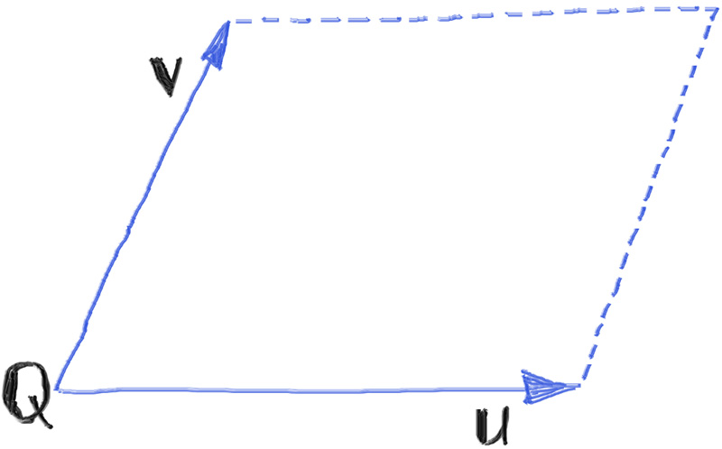
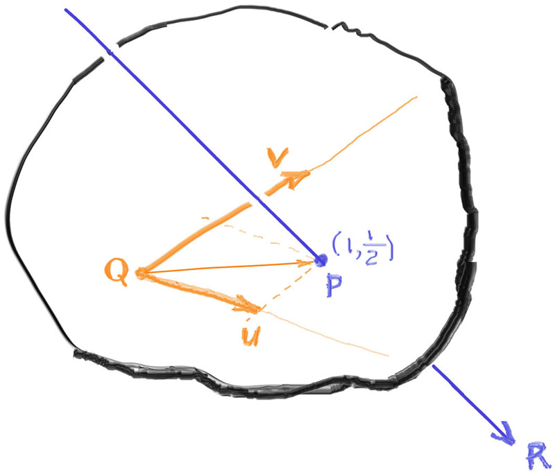
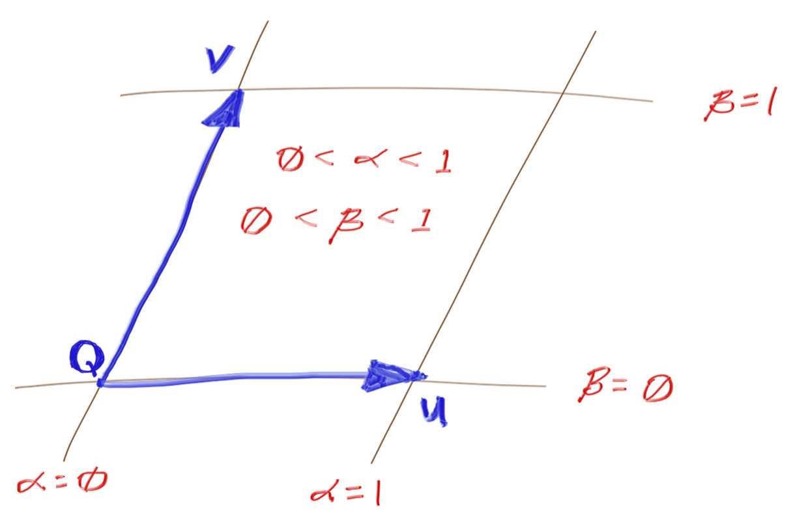
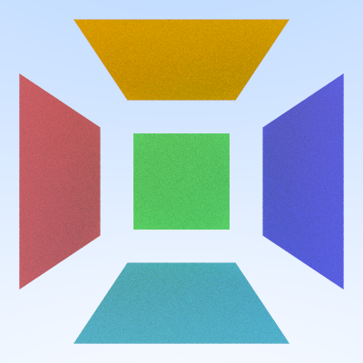

在这套三部曲教材中，我们使用球体作为唯一几何图元已完成了大半内容。现在该引入第二种图元：四边形面片。

# 6.1 定义四边形面片
虽然我们将这个新图元称为"四边形"(quad)，但技术上它属于平行四边形（对边平行）。我们使用三个几何要素来定义：

Q - 起始顶点坐标
u - 第一条边向量（Q+u得到相邻顶点）
v - 第二条边向量（Q+v得到另一相邻顶点）
对角顶点坐标为Q+u+v。这些参数均为三维坐标，尽管四边形本身是二维对象。例如：一个原点起始，沿Z轴延伸2单位，Y轴延伸1单位的四边形，其参数为Q=(0,0,0), u=(0,0,2), v=(0,1,0)。

下图展示了该四边形的构成要素。

四边形是平面图形，因此当它们位于XY、YZ或ZX平面时，其轴向包围盒(AABB)在某一个维度上的厚度为零。这可能导致光线求交计算出现数值问题。我们可以通过对包围盒的零值维度进行填充来解决这个问题。这种填充操作是可行的，因为它不会改变四边形实际的相交区域——我们只是扩展了包围盒范围以消除潜在的数值问题，何况包围盒本来就是对实际形状的粗略近似。为确保新建的AABB始终具有非零体积，我们添加了微量填充值：
#### aabb.h
```c++{highlight=[4,12,15-21] .line-numbers}
···
aabb::aabb(const interval& x, const interval& y, const interval& z) : x(x), y(y), z(z) 
{
    pad_to_minimums();
}

aabb::aabb(const point3& a, const point3& b)
{
    x = ( a[0] <= b[0] ) ? interval(a[0], b[0]) : interval(b[0], a[0]);
    y = ( a[1] <= b[1] ) ? interval(a[1], b[1]) : interval(b[1], a[1]);
    z = ( a[2] <= b[2] ) ? interval(a[2], b[2]) : interval(b[2], a[2]);
    pad_to_minimums();
}
...
void aabb::pad_to_minimums()
{
    double delta = 0.0001;
    if(x.size() < delta) x = x.expand(delta);
    if(y.size() < delta) y = y.expand(delta);
    if(z.size() < delta) z = z.expand(delta);
}

```
现在我们开始构造新的类quad：
#### quad.h
```c++{highlight=[] .line-numbers}
class quad : public hittable
{
public:
    quad(const point3& Q, const vec3& u, const vec3& v ,std::shared_ptr<material> mat);

    virtual void set_bounding_box();
    aabb bounding_box() const override ;

    bool hit(const ray& r ,interval ray_t, hit_record& rec) const override;
    virtual bool is_interior(double a ,double b ,hit_record& rec) const;

private:
    point3 Q;
    vec3 u,v;
    vec3 w;

    std::shared_ptr<material> mat;
    aabb bbox;
    vec3 normal;
    double D;
};
```
#### quad.cpp
```c++{highlight=[] .line-numbers}
quad::quad(const point3& Q, const vec3& u, const vec3& v ,std::shared_ptr<material> mat) :Q(Q),u(u),v(v),mat(mat)
{   
    set_bounding_box();
}

void quad::set_bounding_box()
{
    auto bbox_diagonal1 = aabb(Q,Q + u + v);
    auto bbox_diagonal2 = aabb(Q+u, Q+v);
    bbox = aabb(bbox_diagonal1, bbox_diagonal2);
}

aabb quad::bounding_box() const
{
    return bbox;
}

bool quad::hit(const ray& r, interval ray_t, hit_record& rec) const{
    return false; // To be implemented
}
```

# 6.2 光线-平面求交计算

如代码所示，quad::hit()方法尚待实现。与球体类似，我们需要判断光线是否与四边形相交，并计算交点属性（位置、法线、纹理坐标等）。

四边形光线求交分三步实现：

1. 确定四边形所在平面
2. 求解光线与平面交点
3. 判断交点是否位于四边形内部

我们先解决第二步——通用光线-平面求交算法。虽然球体因其隐式方程求交简单而常作为入门图元，但平面的隐式方程求交其实更为简便。平面隐式方程有两种表示形式：

标准式：Ax + By + Cz + D = 0
变形式：Ax + By + Cz = D （D为待定常数）

几何意义解释：给定平面法向量n=(A,B,C)和位置向量v=(x,y,z)，通过点积可得：

n·v = D

这等价于上述变形式。

将光线方程R(t)=P+td代入：
n·(P + td) = D
解得参数t：
t = (D - n·P) / (n·d)

当分母n·d=0时光线与平面平行，直接判定不相交。若t值超出有效范围也判定不相交。

该算法不仅适用于四边形，也可用于其他平面图元（如三角形、圆盘等）的求交计算。

# 6.3 找到包含给定四边形的平面

我们已经完成了第二步：在已知平面方程的情况下求解光线-平面交点。现在需要解决第一步：根据四边形参数Q、u、v确定所在平面方程。

求解过程非常简单。回顾平面方程Ax+By+Cz=D中，(A,B,C)即平面法向量。我们通过两边向量的叉积计算法向量：
n = unit_vector(u × v)

由于平面方程需满足所有平面上点(x,y,z)，而Q点必然在平面上，因此可求出D值：
$$
D = n_x Q_x + n_y Q_y + n_z Q_z = \mathbf{n} \cdot \mathbf{Q}
$$

将平面相关参数加入四边形类：
#### quad.h
```c++ {highlight=[17,18] .line-numbers}
class quad : public hittable
{
public:
    quad(const point3& Q, const vec3& u, const vec3& v ,std::shared_ptr<material> mat);

    virtual void set_bouding_box();
    aabb bounding_box() const override ;

    bool hit(const ray& r ,interval ray_t, hit_record& rec) const override;

private:
    point3 Q;
    vec3 u,v;

    shared_ptr<material>mat;
    aabb bbox;
    vec3 normal;
    double D;
};
```
#### quad.cpp
```c++ {highlight=[4-6] .line-numbers}
...
quad::quad(const point3& Q, const vec3& u, const vec3% v ,std::shared_ptr<material> mat) :Q(Q),u(u),v(v),mat(mat)
{   
    auto n = cross(u,v);
    normal = unit_vector(n);
    D = dot(normal,Q);

    set_bounding_box();
}
...

```
我们将利用法向量normal和常量D来求解给定光线与四边形所在平面的交点。

作为阶段性实现，先编写hit()方法来处理包含四边形的无限大平面求交：
#### quad.cpp
```c++ {highlight=[3-19] .line-numbers}
...
bool quad::hit(const ray& r, interval ray_t, hit_record& rec) const{
    auto denom = dot(normal, r.direction());

    if (std::fabs(denom) < 1e-8)
        return false;
    
    auto t = (D - dot(normal, r.GetOrigin())) / denom;
    if(!ray_t.contains(t))
        return false;

    auto intersection = r.at(t);

    rec.t = t;
    rec.p = intersection;
    rec.mat = mat;
    rec.set_face_normal(r,normal);

    return true;
}
...
```

# 6.4 
在此阶段，交点位于包含四边形的平面上，但可能位于平面任意位置：射线与平面的交点可能落在四边形内部或外部。我们需要检测位于四边形内部的交点（命中），并排除外部交点（未命中）。为确定交点相对于四边形的位置关系，并为交点分配纹理坐标，需在平面上对交点进行定向处理。

为此，我们将为平面构建一个坐标系框架——用于定位平面上任意点的方法。我们已经在三维空间中使用坐标系框架，该框架由原点O和三个基向量x、y、z定义。

由于平面是二维结构，我们仅需要一个平面原点Q和两个基向量：u与v。通常坐标轴应彼此垂直，但为覆盖整个空间，并不必须满足此条件——只需确保两个轴不互相平行即可。


以上图为例，射线R与平面相交产生交点P（注意区别于前文所述的射线原点P）。根据平面向量u和v进行测量，上例中的交点P位于Q+(1)u+(1/2)v处。换言之，交点P的UV（平面）坐标为(1, 1/2)。

对于任意给定点P，我们需要求解两个标量值α和β，使得：
P = Q + αu + βv

通过推导可得，平面坐标α和β由以下方程给出：
α = w·(p×v)
β = w·(u×p)

其中：
p = P - Q
w = n / [n·(u×v)] = n / (n·n)

对于特定四边形而言，向量w是恒定值，因此我们将缓存该值。
#### quad.h
```c++ {highlight=[8] .line-numbers}
class quad : public hittable
{
...

private:
    point3 Q;
    vec3 u,v;
    vec3 w;

    std::shared_ptr<material> mat;
    aabb bbox;
    vec3 normal;
    double D;
};
```
#### quad.cpp
```c++ {highlight=[6] .line-numbers}
quad::quad(const point3& Q, const vec3& u, const vec3% v ,std::shared_ptr<material> mat) :Q(Q),u(u),v(v),mat(mat)
{   
    auto n = cross(u,v);
    normal = unit_vector(n);
    D = dot(normal,Q);
    w = n / dot(n,n);
    set_bounding_box();
}
```

# 6.5 推导平面坐标
略

# 6.6 利用UV坐标进行交点内部性测试

在获得交点平面坐标α和β后，我们可据此轻松判定该交点是否位于四边形内部——即判断射线是否真实击中了四边形。
平面坐标系被划分为如下区域：


因此，要判断具有平面坐标(α,β)的点是否位于四边形内部，只需满足以下条件：

0≤α≤1
0≤β≤1
这便是实现四边形图元所需的最后环节。

为便于实验操作，我们将从hit方法中抽离出(α,β)内部性测试方法。
#### quad.cpp
```c++ {highlight=[13-18,27-36] .line-numbers}
bool quad::hit(const ray& r, interval ray_t, hit_record& rec) const{
    auto denom = dot(normal, r.GetDirection());
    
    // No hit if the ray is parallel to the plane.
    if (std::fabs(denom) < 1e-8)
        return false;
    
    auto t = (D - dot(normal, r.GetOrigin())) / denom;
    if(!ray_t.contains(t))
        return false;

    auto intersection = r.at(t);
    vec3 planar_hitpt_vector = intersection - Q;
    auto alpha = dot(w,cross(planar_hitpt_vector,v));
    auto beta = dot(w,cross(u,planar_hitpt_vector));

    if (!is_interior(alpha, beta, rec))
        return false;
    rec.t = t;
    rec.p = intersection;
    rec.mat = mat;
    rec.set_face_normal(r,normal);

    return true;
}
...
bool quad::is_interior(double a, double b ,hit_record& rec)  const
{
    interval unit_interval = interval(0,1);
    if(!unit_interval.contains(a) || !unit_interval.contains(b)) 
        return false;
    
    rec.u = a;
    rec.v = b;
    return true;
}
```

#### test.cpp
```c++ {highlight=[6,8-40] .line-numbers}
...
#include "hittable.h"
#include "hittable_list.h"
#include "sphere.h"
#include "material.h"
#include "quad.h"
...
void quads()
{
    hittable_list world;

    auto left_red = make_shared<lambertian>(color(1.0,0.2,0.2));
    auto back_green = make_shared<lambertian>(color(0.2,1.0,0.2));
    auto right_blue = make_shared<lambertian>(color(0.2,0.2,1.0));
    auto upper_orange = make_shared<lambertian>(color(1.0,0.5,0.0));
    auto lower_teal = make_shared<lambertian>(color(0.2,0.8,0.8));

    world.add(make_shared<quad>(point3(-3,-2, 5), vec3(0, 0,-4), vec3(0, 4, 0), left_red));
    world.add(make_shared<quad>(point3(-2,-2, 0), vec3(4, 0, 0), vec3(0, 4, 0), back_green));
    world.add(make_shared<quad>(point3( 3,-2, 1), vec3(0, 0, 4), vec3(0, 4, 0), right_blue));
    world.add(make_shared<quad>(point3(-2, 3, 1), vec3(4, 0, 0), vec3(0, 0, 4), upper_orange));
    world.add(make_shared<quad>(point3(-2,-3, 5), vec3(4, 0, 0), vec3(0, 0,-4), lower_teal));
    
    camera cam;

    cam.aspect_ratio = 1.0;
    cam.image_width = 400;
    cam.samples_per_pixel = 100;
    cam.max_depth = 50;
    cam.background = color(0.70,0.80,1.00);

    cam.vfov = 80;
    cam.lookfrom = point3(0,0,9);
    cam.lookat = point3(0,0,0);
    cam.vup = vec3(0,1,0);

    cam.defocus_angle = 0;
    cam.render(world);

}
```
结果如下：


## 6.7 其他二维图元
稍作停顿，思考一下：若用(α,β)坐标系判断点是否在四边形（平行四边形）内，那么用同样的二维坐标系判断交点是否在其他二维（平面）图元内也就不难想象了！

例如，假设我们将is_interior()函数改为当sqrt(aa + bb) < r时返回true，这就实现了半径为r的圆形图元。对于三角形，可尝试a > 0 && b > 0 && a + b < 1的条件判断。

更多二维形状的可能性留给读者作为练习，取决于你的探索意愿。你甚至可以根据纹理贴图的像素创建镂空模板，或是曼德博集合形状！作为一个小彩蛋，可以查看源代码库中的alternate-2D-primitives标签——在src/TheNextWeek/quad.h文件中提供了三角形、椭圆和环形（圆环）的解决方案。