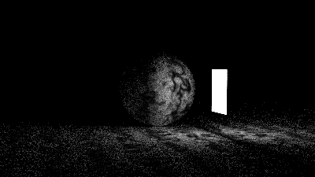
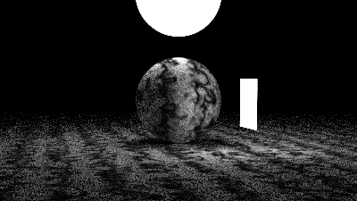
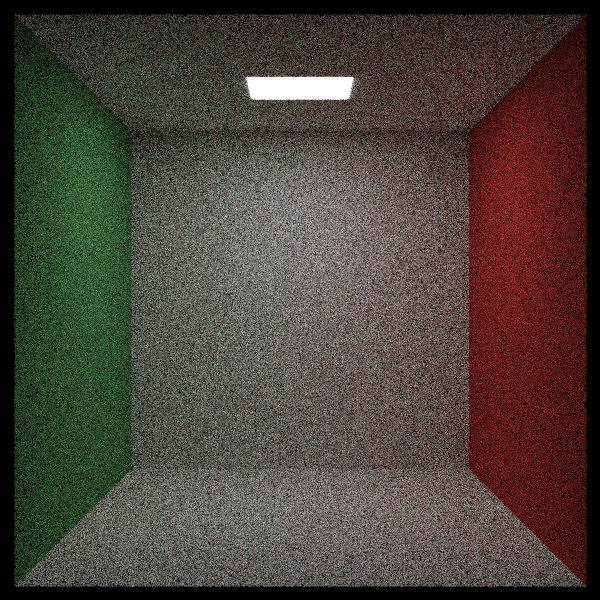

# 7 光
光照是光线追踪的核心要素。早期的简易光线追踪器采用抽象光源，如空间中的点光源或方向光。现代方法则采用更具物理真实性的光源，这些光源具有具体位置和尺寸。要实现这类光源，我们需要能够将任意常规物体转化为可向场景发射光线的发光体。

## 7.1 自发光材质
首先，我们创建发光材质。需要添加emitted函数（也可将其加入hit_record结构体——这属于设计偏好问题）。与背景光类似，该函数仅返回光线颜色而不进行反射计算，其实现非常简单：
#### material.h
```c++ {highlight=[] .line-numbers}
...
class diffuse_light : public material{
public:
    diffuse_light(std::shared_ptr<texture> tex);
    diffuse_light(const color& emit);

    color emitted(double u ,double v ,const point3& p) const override;

private:
    shared_ptr<texture> tex;
};
...
```
为避免所有非发光材质强制实现emitted()函数，我让基类直接返回黑色:
#### material.h
```c++ {highlight=[6-8] .line-numbers}
class material
{
public:
    virtual ~material() = default;

    virtual color emitted(double u,double v, const point3& p) const{
        return color(0,0,0);
    }

    virtual bool scatter(const ray& r_in, const hit_record& rec, color& attenuation,ray& scattered) const
    {
        return false;
    }
};
```

## 7.2 为光线着色函数添加背景颜色
接下来，我们需要纯黑色背景，使场景中唯一的光源来自发光材质。为此，我们将在ray_color函数中添加背景颜色参数，并注意新增的color_from_emission值。
#### camera.h
```c++ {highlight=[9] .line-numbers}
class camera
{
...
public:
    double aspect_ratio = 1.0;  // Ratio of image width over height
    int    image_width  = 100;
    int    samples_per_pixel = 10;
    int    max_depth         = 10;
    color  background;
...
}
```
#### camera.cpp
```c++ {highlight=[9-21] .line-numbers}
color camera::ray_color(const ray& r, int depth, const hittable& world) const
{   // 若光线反弹次数超过限制，则不再收集光照
    if (depth <= 0)
        return color(0,0,0);
    
    hit_record rec;

    //若光线未击中任何物体，则返回背景色。
    if (!world.hit(r,interval(0.001,infinity),rec))
        return background;
    
    ray scattered;
    color attenuation;
    color color_from_emission = rec.mat->emitted(rec.u,rec.v,rec.p);

    if (!rec.mat->scatter(r,rec,attenuation,scattered))
        return color_from_emission;

    color color_from_scatter = attenuation * ray_color(scattered,depth - 1, world);

    return color_from_emission + color_from_scatter; 
}

```
由于我们移除了用于确定光线击中天空时颜色的代码，现在需要为旧场景渲染传入一个新的颜色值。我们决定统一使用单一的蓝白色作为整个天空背景。当然，你也可以传入一个布尔值来切换使用之前的天空盒代码或新的纯色背景。这里我们选择保持简洁的实现方式。

## 7.3 
如果我们设置一个矩形作为光源:
#### test.cpp
```c++ {highlight=[1-28,31,37] .line-numbers}
void simple_light()
{
    hittable_list world;

    auto pertext = make_shared<noise_texture>(4);
    world.add(make_shared<sphere>(point3(0,-1000,0),1000,make_shared<lambertian>(pertext)));
    world.add(make_shared<sphere>(point3(0,2,0),2,make_shared<lambertian>(pertext)));

    auto difflight = make_shared<diffuse_light>(color(4,4,4));
    world.add(make_shared<quad>(point3(3,1,-2),vec3(2,0,0),vec3(0,2,0),difflight));

    camera cam;
    
    cam.aspect_ratio = 16.0/9.0;
    cam.image_width = 400;
    cam.samples_per_pixel = 100;
    cam.max_depth = 50;
    cam.background = color(0,0,0);
    
    cam.vfov = 20;
    cam.lookfrom = point3(26,3,6);
    cam.lookat = point3(0,2,0);
    cam.vup = vec3(0,1,0);

    cam.defocus_angle = 0;
    cam.render(world);
}

int main() {
    switch (6) {
        case 1:  bouncing_spheres();   break;
        case 2:  checkered_spheres();  break;
        case 3:  earth();              break;
        case 4:  perlin_spheres();     break;
        case 5:  quads();              break;
        case 6:  simple_light();       break;
    }
}
```
得到：

#### test.cpp
```c++ {highlight=[5] .line-numbers}
void simple_light()
{
    ...
    auto difflight = make_shared<diffuse_light>(color(4,4,4));
    world.add(make_shared<sphere>(point3(0,7,0), 2, difflight));
    world.add(make_shared<quad>(point3(3,1,-2),vec3(2,0,0),vec3(0,2,0),difflight));

    ...
}
```
得到：


## 7.4 创建一个空的“Cornell Box”
“Cornell Box”于1984年提出，用于模拟漫反射表面之间的光线交互作用。现在我们来构建这个盒子的五个墙面和光源：
#### test.cpp
```c++ {highlight=[5] .line-numbers}
void cornell_box()
{
    hittable_list world;

    auto red = make_shared<lambertian>(color(0.65,0.05,0.05));
    auto white = make_shared<lambertian>(color(0.73,0.73,0.73));
    auto green = make_shared<lambertian>(color(0.12,0.45,0.15));
    auto light = make_shared<diffuse_light>(color(15,15,15));

    world.add(make_shared<quad>(point3(555,0,0), vec3(0,555,0), vec3(0,0,555), green));
    world.add(make_shared<quad>(point3(0,0,0), vec3(0,555,0), vec3(0,0,555), red));
    world.add(make_shared<quad>(point3(343, 554, 332), vec3(-130,0,0), vec3(0,0,-105), light));
    world.add(make_shared<quad>(point3(0,0,0), vec3(555,0,0), vec3(0,0,555), white));
    world.add(make_shared<quad>(point3(555,555,555), vec3(-555,0,0), vec3(0,0,-555), white));
    world.add(make_shared<quad>(point3(0,0,555), vec3(555,0,0), vec3(0,555,0), white));
   
     
    camera cam;

    cam.aspect_ratio      = 1.0;
    cam.image_width       = 600;
    cam.samples_per_pixel = 200;
    cam.max_depth         = 50;
    cam.background        = color(0,0,0);

    cam.vfov     = 40;
    cam.lookfrom = point3(278, 278, -800);
    cam.lookat   = point3(278, 278, 0);
    cam.vup      = vec3(0,1,0);

    cam.defocus_angle = 0;

    cam.render(world);
}

int main() {
    switch (7) {
        case 1:  bouncing_spheres();   break;
        case 2:  checkered_spheres();  break;
        case 3:  earth();              break;
        case 4:  perlin_spheres();     break;
        case 5:  quads();              break;
        case 6:  simple_light();       break;
        case 7:  cornell_box();        break;
    }
}
```
得到：


这张图像噪点很多，因为光源很小，所以大多数随机光线都无法照射到光源上。