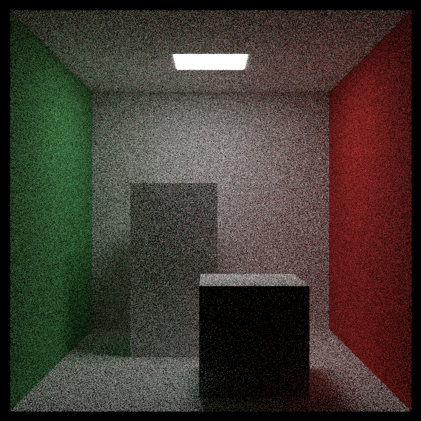
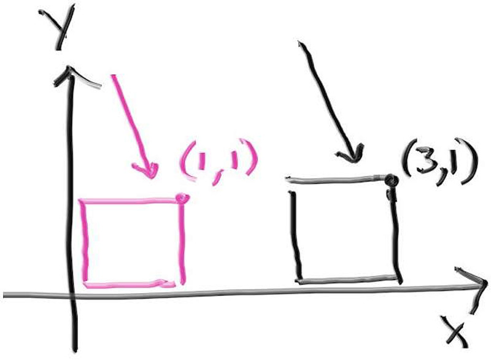
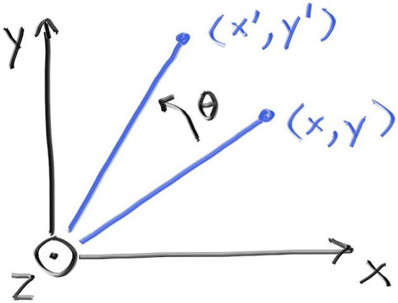
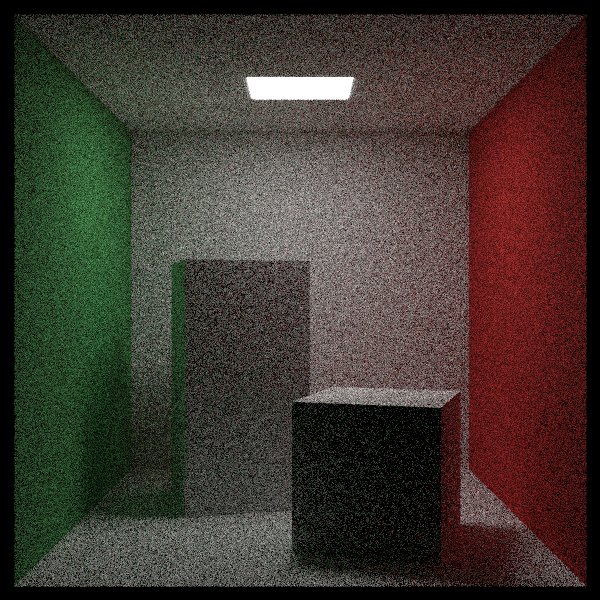

# 8实例
康奈尔盒内通常放置两个立方体。首先，我们通过构建包含六个矩形的hittable_list来创建返回立方体的函数：
#### quad.h
```c++ {highlight=[2,9-28] .line-numbers}
#include "hittable.h"
#include "hittable_list.h"

class quad : public hittable
{
    ...
};

inline std::shared_ptr<hittable_list> box(const point3& a,const point3& b, std::shared_ptr<material>mat)
{
    auto sides = std::make_shared<hittable_list>();

    auto min = point3(std::fmin(a.GetX(),b.GetX()),std::fmin(a.GetY(),b.GetY()),std::fmin(a.GetZ(),b.GetZ()));
    auto max = point3(std::fmax(a.GetX(),b.GetX()),std::fmax(a.GetY(),b.GetY()),std::fmax(a.GetZ(),b.GetZ()));

    auto dx = vec3(max.GetX() - min.GetX(),0,0);
    auto dy = vec3(0,max.GetY() - min.GetY(),0);
    auto dz = vec3(0,0,max.GetZ() - min.GetZ());

    sides->add(make_shared<quad>(point3(min.GetX(), min.GetY(), max.GetZ()),  dx,  dy, mat)); // front
    sides->add(make_shared<quad>(point3(max.GetX(), min.GetY(), max.GetZ()), -dz,  dy, mat)); // right
    sides->add(make_shared<quad>(point3(max.GetX(), min.GetY(), min.GetZ()), -dx,  dy, mat)); // back
    sides->add(make_shared<quad>(point3(min.GetX(), min.GetY(), min.GetZ()),  dz,  dy, mat)); // left
    sides->add(make_shared<quad>(point3(min.GetX(), max.GetY(), max.GetZ()),  dx, -dz, mat)); // top
    sides->add(make_shared<quad>(point3(min.GetX(), min.GetY(), min.GetZ()),  dx,  dz, mat)); // bottom

    return sides;
}
```

#### test.cpp
```c++ {highlight=[11-12] .line-numbers}
void cornell_box()
{
    ...
    world.add(make_shared<quad>(point3(555,0,0), vec3(0,555,0), vec3(0,0,555), green));
    world.add(make_shared<quad>(point3(0,0,0), vec3(0,555,0), vec3(0,0,555), red));
    world.add(make_shared<quad>(point3(343, 554, 332), vec3(-130,0,0), vec3(0,0,-105), light));
    world.add(make_shared<quad>(point3(0,0,0), vec3(555,0,0), vec3(0,0,555), white));
    world.add(make_shared<quad>(point3(555,555,555), vec3(-555,0,0), vec3(0,0,-555), white));
    world.add(make_shared<quad>(point3(0,0,555), vec3(555,0,0), vec3(0,555,0), white));

    world.add(box(point3(130, 0, 65), point3(295, 165, 230), white));
    world.add(box(point3(265, 0, 295), point3(430, 330, 460), white));
    
    camera cam;
    ...
}
```
结果如下：


现在我们有了盒子，需要稍微旋转它们以匹配真实的康奈尔盒子。在光线追踪中，通常通过实例化来实现这一点。实例是指被放置到场景中的几何图元的一个副本。这个实例完全独立于该图元的其他副本，可以进行移动或旋转。在本例中，我们的几何图元就是可碰撞的盒子对象，而我们想要旋转它。这在光线追踪中特别容易实现，因为我们实际上不需要移动场景中的物体；相反，我们以相反方向移动光线。例如，考虑一个平移（通常称为移动）。我们可以将位于原点的粉色盒子的所有x分量加2，或者（正如我们在光线追踪中几乎总是做的那样）保持盒子不动，但在其碰撞检测例程中，将光线起点的x分量减去2。

## 8.1 实例平移变换

你可以将其视为移动或坐标变换，这取决于你的理解。具体思路是将入射光线反向移动偏移量，判断是否发生相交，然后将交点正向移动相同的偏移量。

我们需要将交点正向移动偏移量，这样交点才会真正位于入射光线的路径上。如果忘记前移交点，那么交点将位于偏移后的光线路径上，这是不正确的。现在让我们添加实现这一逻辑的代码。
#### hittable.h
```c++ {highlight=[] .line-numbers}
class translate : public hittable
{
public:
    translate(std::shared_ptr<hittable> object,const vec3& offset)
        : object(object),offset(offset)
    {
        bbox = object->bounding_box() + offset;
    }

    bool hit(const ray& r, interval ray_t,hit_record& rec) const override
    {    // Move the ray backwards by the offset
        ray offset_r(r.GetOrigin() - offset, r.GetDirection(),r.time());
        //Determine whether an intersection exists along the offset ray (and if so, where)
        if(!object->hit(offset_r, ray_t,rec))
            return false;
        rec.p += offset;
        return true;
    }

    aabb bounding_box() const override { return bbox; };
private:
    std::shared_ptr<hittable> object;
    vec3 offset;
    aabb bbox;
};
```
我们还需要记得对边界框进行偏移，否则入射光线可能会错误地检测位置并直接排除相交情况。上述表达式object->bounding_box() + offset需要额外的支持实现。
#### aabb.h
```c++ {highlight=[] .line-numbers}
...
inline aabb operator+(const aabb& bbox, const vec3& offset) {
    return aabb(bbox.x + offset.GetX(), bbox.y + offset.GetY(), bbox.z + offset.GetZ());
}

inline aabb operator+(const vec3& offset, const aabb& bbox) {
    return bbox + offset;
}
```
#### interval.h
```c++ {highlight=[] .line-numbers}
...
inline interval operator+(const interval& ival, double displacement) {
    return interval(ival.minn + displacement, ival.maxn + displacement);
}

inline interval operator+(double displacement, const interval& ival) {
    return ival + displacement;
}
```

## 8.2 实例旋转变换
旋转操作的理解和公式推导相对不那么直观。图形学中常用的策略是分别绕x、y、z轴进行旋转处理，这类旋转在某种意义上是与坐标轴对齐的。首先考虑绕z轴旋转θ角度，这个变换只会改变x和y坐标值，且变换过程与z坐标无关。

这涉及到一些基础的三角学运算，我会在此略过具体公式推导过程。虽然步骤略显繁琐，但原理是直观的——你可以在任何图形学教材或讲义中找到相关推导。最终得出的绕z轴逆时针旋转公式如下：
\[
\begin{aligned}
x' &= \cos(\theta) \cdot x - \sin(\theta) \cdot y \\
y' &= \sin(\theta) \cdot x + \cos(\theta) \cdot y
\end{aligned}
\]

最棒的是，这种方法适用于任何角度θ，且无需考虑象限或其他特殊情况。逆变换则是相反的几何操作：旋转-θ角度。这里需要记住的是，cos(θ) = cos(-θ)且sin(-θ) = -sin(θ)，因此公式非常简单。

同理，对于绕y轴旋转（就像我们对盒子中的方块所做的那样），公式如下：
\[
\begin{aligned}
x' &= \cos(\theta) \cdot x + \sin(\theta) \cdot z \\
z' &= -\sin(\theta) \cdot x + \cos(\theta) \cdot z
\end{aligned}
\]
如果我们想绕x轴旋转：
\[
\begin{aligned}
y' &= \cos(\theta) \cdot y - \sin(\theta) \cdot z \\
z' &= \sin(\theta) \cdot y + \cos(\theta) \cdot z
\end{aligned}
\]

将平移视为初始光线的简单移动，是理解其原理的好方法。但对于旋转这类更复杂的操作，很容易混淆概念（或遗漏负号），因此最好将旋转视为坐标系的变换。

上述translate::hit函数的伪代码从位移角度描述了该功能：

1.将光线反向移动偏移量
2.判断偏移后的光线是否存在交点（若存在则确定位置）
3.将交点正向移动偏移量
但也可以从坐标系转换的角度来理解：

1.将光线从世界坐标系转换到物体坐标系
2.判断物体坐标系中是否存在交点（若存在则确定位置）
3.将交点从物体坐标系转换回世界坐标系

旋转物体不仅会改变交点位置，还会改变表面法向量，进而影响反射和折射方向。因此我们也需要调整法向量。幸运的是，法向量会像普通向量一样旋转，所以可以使用相同的变换公式。虽然对于经历旋转和平移的物体而言，法向量和普通向量看似相同，但进行缩放变换时需要特别注意保持法向量与表面正交。这里不作展开，但若实现缩放功能时应当研究表面法向量的变换规则。

我们首先需要将光线从世界坐标系转换到物体坐标系，对于旋转而言这意味着反向旋转-θ角度。上述translate::hit函数的伪代码从位移角度描述了该功能：

1.将光线反向移动偏移量
2.判断偏移后的光线是否存在交点（若存在则确定位置）
3.将交点正向移动偏移量
但也可以从坐标系转换的角度来理解：

1.将光线从世界坐标系转换到物体坐标系
2.判断物体坐标系中是否存在交点（若存在则确定位置）
3.将交点从物体坐标系转换回世界坐标系
旋转物体不仅会改变交点位置，还会改变表面法向量，进而影响反射和折射方向。因此我们也需要调整法向量。幸运的是，法向量会像普通向量一样旋转，所以可以使用相同的变换公式。虽然对于经历旋转和平移的物体而言，法向量和普通向量看似相同，但进行缩放变换时需要特别注意保持法向量与表面正交。这里不作展开，但若实现缩放功能时应当研究表面法向量的变换规则。

我们首先需要将光线从世界坐标系转换到物体坐标系，对于旋转而言这意味着反向旋转-θ角度。
\[
\begin{aligned}
x' &= \cos(\theta) \cdot x - \sin(\theta) \cdot z \\
z' &= \sin(\theta) \cdot x + \cos(\theta) \cdot z
\end{aligned}
\]

我们现在可以创建一个用于y轴旋转的类。首先来解决碰撞检测函数：
#### hittable.h
```c++ {highlight=[] .line-numbers}
class rotate_y : public hittable
{
public:
    rotate_y(std::shared_ptr<hittable> object, double angle) : object(object)
    {
        auto radians = degrees_to_radians(angle);
        sin_theta = std::sin(radians);
        cos_theta = std::cos(radians);
        bbox = object->bounding_box();

        point3 min( infinity, infinity, infinity);
        point3 max(-infinity, -infinity, -infinity);

        for(int i=0;i<2;i++){
            for(int j=0;j<2;j++){
                for(int k =0;k<2;k++)
                {
                    auto x = i * bbox.x.maxn + (1-i) * bbox.x.minn;
                    auto y = j * bbox.y.maxn + (1-j) * bbox.y.minn;
                    auto z = k * bbox.z.maxn + (1-k) * bbox.z.minn;

                    auto newx =  cos_theta*x + sin_theta*z;
                    auto newz = -sin_theta*x + cos_theta*z;
                    
                    vec3 tester(newx, y, newz);

                    for (int c = 0; c < 3; c++) {
                        min[c] = std::fmin(min[c], tester[c]);
                        max[c] = std::fmax(max[c], tester[c]);
                    }
                }
            }
        }
        bbox = aabb(min, max);
    }

    bool hit(const ray& r, interval ray_t, hit_record& rec) const override
    {
        auto origin = point3(
            (cos_theta * r.GetOrigin().GetX()) - (sin_theta*r.GetOrigin().GetZ()),
            r.GetOrigin().GetY(),
            (sin_theta * r.GetOrigin().GetX()) + (cos_theta*r.GetOrigin().GetZ())
        );

        auto direction = vec3(
            (cos_theta * r.GetDirection().GetX()) - (sin_theta*r.GetDirection().GetZ()),
            r.GetDirection().GetY(),
            (sin_theta * r.GetDirection().GetX()) + (cos_theta*r.GetDirection().GetZ())
        );

        ray rotate_r(origin,direction,r.time());

        if (!object -> hit(rotate_r,ray_t,rec))
            return false;

        rec.p = point3(
            (cos_theta * rec.p.GetX()) + (sin_theta * rec.p.GetZ()),
            rec.p.GetY(),
            (-sin_theta * rec.p.GetX()) + (cos_theta * rec.p.GetZ())
        );

        rec.normal = vec3(
            (cos_theta * rec.normal.GetX()) + (sin_theta * rec.normal.GetZ()),
            rec.normal.GetY(),
            (-sin_theta * rec.normal.GetX()) + (cos_theta * rec.normal.GetZ())
        );
        return true;
    }

    aabb bounding_box() const override {return bbox;}

private:
    std::shared_ptr<hittable> object;
    double sin_theta;
    double cos_theta;
    aabb bbox;
};
```
#### test.cpp
```c++ {highlight=[] .line-numbers}
void cornell_box()
{
    ...
    shared_ptr<hittable> box1 = box(point3(0,0,0), point3(165,330,165), white);
    box1 = make_shared<rotate_y>(box1, 15);
    box1 = make_shared<translate>(box1, vec3(265,0,295));
    world.add(box1);

    shared_ptr<hittable> box2 = box(point3(0,0,0), point3(165,165,165), white);
    box2 = make_shared<rotate_y>(box2, -18);
    box2 = make_shared<translate>(box2, vec3(130,0,65));
    world.add(box2);
    
    camera cam;
    ...
}
```
得到：
