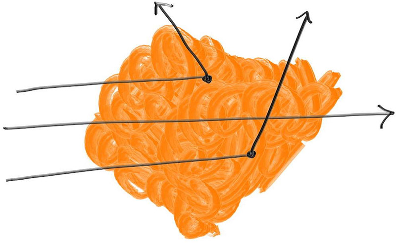

# 9 体积介质
给光线追踪器添加烟雾/雾气/薄雾效果是个不错的选择。这些效果有时被称为体积介质或参与介质。另一个值得加入的特性是次表面散射，这有点像物体内部的浓雾。
通常这会给软件架构带来混乱，因为体积介质与表面处理截然不同，但有个巧妙技巧——将体积介质转化为随机表面。我们可以用概率性存在的表面来代替整团烟雾，即在体积中的每个点都可能存在或不存在表面。当你看到代码时，这个概念会变得更加清晰。

## 9.1恒定密度介质

首先，我们从恒定密度的体积开始讨论。光线穿过该体积时，可能会在内部发生散射，也可能像图中中间那条光线一样完全穿透。对于更稀薄的透明体积（例如薄雾），光线更有可能像中间那条光线一样直接穿透。光线在体积中需要穿行的距离同样决定了其成功穿透的概率。

当光线穿过体积时，它可能在任意点发生散射。体积密度越大，散射概率越高。光线在任意微小距离ΔL内发生散射的概率为：

$$ \text{probability} = C \cdot \Delta L $$

其中，C与体积的光学密度成正比。如果遍历所有微分方程，你会得到一个随机数对应的散射发生距离。若该距离超出体积范围，则判定为"未命中"。对于恒定密度的体积，我们仅需知道密度C和边界条件即可。边界部分我将使用另一个可命中对象来处理。

最终实现的类如下：
#### constant_medium.h
```c++ {highlight=[] .line-numbers}
class constant_medium : public hittable
{
public:
    constant_medium(std::shared_ptr<hittable> boundary,double density,std::shared_ptr<texture> tex);
    constant_medium(std::shared_ptr<hittable> boundary,double density,const color& albedo);   
    
    bool hit(const ray& r, interval ray_t, hit_record& rec) const override;

    aabb bounding_box() const override ;

private:
    std::shared_ptr<hittable> boundary;
    double neg_inv_density;
    std::shared_ptr<material> phase_function;
};
```
#### constant_medium.cpp
```c++ {highlight=[] .line-numbers}
#include "constant_medium.h"

constant_medium::constant_medium(shared_ptr<hittable> boundary, double density, shared_ptr<texture> tex)
      : boundary(boundary), neg_inv_density(-1/density),
        phase_function(make_shared<isotropic>(tex))
       {}

constant_medium::constant_medium(shared_ptr<hittable> boundary, double density, const color& albedo)
      : boundary(boundary), neg_inv_density(-1/density),
        phase_function(make_shared<isotropic>(albedo))
    {}

bool constant_medium::hit(const ray& r, interval ray_t, hit_record& rec) const  {
        hit_record rec1, rec2;
        
        //检测光线是否与体积的外边界相交
        if (!boundary->hit(r, interval::universe, rec1))
            return false;
        //检测光线是否离开体积
        if (!boundary->hit(r, interval(rec1.t+0.0001, infinity), rec2))
            return false;

        if (rec1.t < ray_t.minn) rec1.t = ray_t.minn;
        if (rec2.t > ray_t.maxn) rec2.t = ray_t.maxn;

        if (rec1.t >= rec2.t)
            return false;

        if (rec1.t < 0)
            rec1.t = 0;

        //计算光线在体积内的传播距离    
        auto ray_length = r.GetDirection().length();
        auto distance_inside_boundary = (rec2.t - rec1.t) * ray_length;

        // 随机决定光线是否在体积内发生散射
        auto hit_distance = neg_inv_density * std::log(random_double());
        if (hit_distance > distance_inside_boundary)
            return false;

        // 计算散射点的位置和属性
        rec.t = rec1.t + hit_distance / ray_length;
        rec.p = r.at(rec.t);

        rec.normal = vec3(1,0,0);  // arbitrary
        rec.front_face = true;     // also arbitrary
        rec.mat = phase_function;

        return true;
    }

aabb constant_medium::bounding_box() const { return boundary->bounding_box(); }
```
各向同性散射函数选取一个均匀随机方向：
#### matetrial.h
```c++ {highlight=[] .line-numbers}
...
class isotropic: public material{
public:
    isotropic(const color& albedo);
    isotropic(std::shared_ptr<texture> tex);

    bool scatter(const ray& r_in, const hit_record& rec, color& attenuation, ray& scattered) const override;

private:
    std::shared_ptr<texture> tex;
};
```

#### matetrial.cpp
```c++ {highlight=[] .line-numbers}
...
sotropic::isotropic(const color& albedo): tex(make_shared<solid_color>(albedo)) {}
isotropic::isotropic(shared_ptr<texture> tex) : tex(tex) {}

bool isotropic::scatter(const ray& r_in, const hit_record& rec, color& attenuation, ray& scattered) const
{
    scattered = ray(rec.p, random_unit_vector(), r_in.time());
    attenuation = tex->value(rec.u, rec.v, rec.p);
    return true;
}
...
```
我们必须如此谨慎处理边界逻辑的原因在于，需要确保该方案对体积内部的射线起点同样有效。在云体渲染中，光线往往会发生多次散射，因此这种情况十分常见。

此外，上述代码默认射线一旦离开恒定介质边界，就会永远在边界外传播。换言之，该方案假设边界形状是凸面的。因此当前实现适用于立方体或球体等边界，但不适用于环形体或含空腔的几何结构。虽然可以实现支持任意形状的算法，但我们将其留作读者练习

## 9.2 渲染带有烟和雾的康奈尔盒子
如果我们用烟雾和雾气（深色和浅色粒子）替换这两个方块，并将光线调大（同时调暗以避免场景过曝），以加快收敛速度：
#### test.cpp
```c++ {highlight=[] .line-numbers}
...

void cornell_smoke() {
    hittable_list world;

    auto red   = make_shared<lambertian>(color(.65, .05, .05));
    auto white = make_shared<lambertian>(color(.73, .73, .73));
    auto green = make_shared<lambertian>(color(.12, .45, .15));
    auto light = make_shared<diffuse_light>(color(7, 7, 7));

    world.add(make_shared<quad>(point3(555,0,0), vec3(0,555,0), vec3(0,0,555), green));
    world.add(make_shared<quad>(point3(0,0,0), vec3(0,555,0), vec3(0,0,555), red));
    world.add(make_shared<quad>(point3(113,554,127), vec3(330,0,0), vec3(0,0,305), light));
    world.add(make_shared<quad>(point3(0,555,0), vec3(555,0,0), vec3(0,0,555), white));
    world.add(make_shared<quad>(point3(0,0,0), vec3(555,0,0), vec3(0,0,555), white));
    world.add(make_shared<quad>(point3(0,0,555), vec3(555,0,0), vec3(0,555,0), white));

    shared_ptr<hittable> box1 = box(point3(0,0,0), point3(165,330,165), white);
    box1 = make_shared<rotate_y>(box1, 15);
    box1 = make_shared<translate>(box1, vec3(265,0,295));

    shared_ptr<hittable> box2 = box(point3(0,0,0), point3(165,165,165), white);
    box2 = make_shared<rotate_y>(box2, -18);
    box2 = make_shared<translate>(box2, vec3(130,0,65));

    world.add(make_shared<constant_medium>(box1, 0.01, color(0,0,0)));
    world.add(make_shared<constant_medium>(box2, 0.01, color(1,1,1)));

    camera cam;

    cam.aspect_ratio      = 1.0;
    cam.image_width       = 600;
    cam.samples_per_pixel = 200;
    cam.max_depth         = 50;
    cam.background        = color(0,0,0);

    cam.vfov     = 40;
    cam.lookfrom = point3(278, 278, -800);
    cam.lookat   = point3(278, 278, 0);
    cam.vup      = vec3(0,1,0);

    cam.defocus_angle = 0;

    cam.render(world);
}

int main() {
    switch (8) {
        case 1:  bouncing_spheres();   break;
        case 2:  checkered_spheres();  break;
        case 3:  earth();              break;
        case 4:  perlin_spheres();     break;
        case 5:  quads();              break;
        case 6:  simple_light();       break;
        case 7:  cornell_box();        break;
        case 8:  cornell_smoke();      break;
    }
}
```