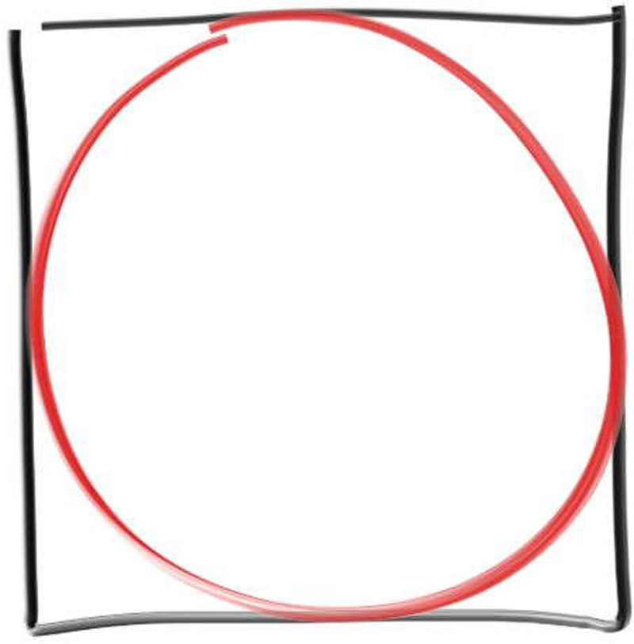
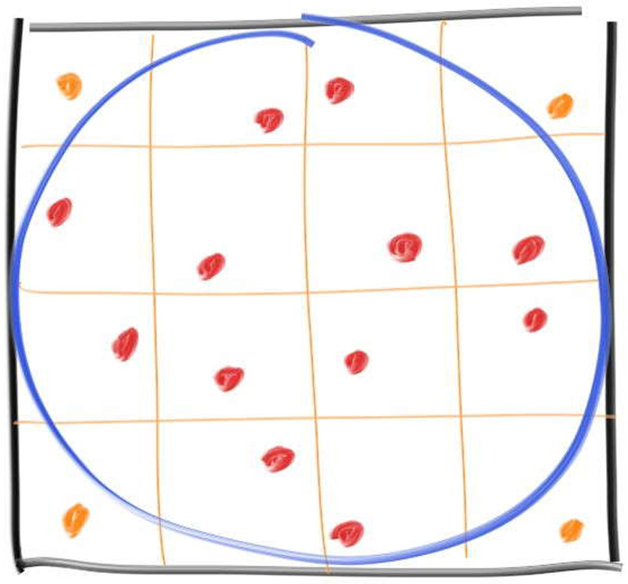
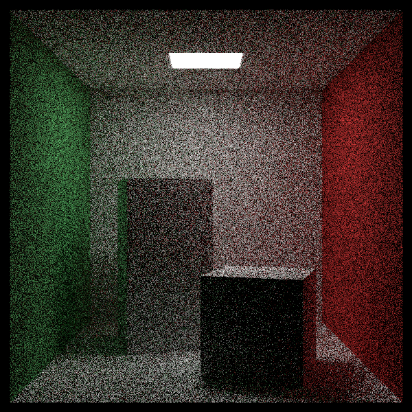

让我们从最简单的蒙特卡洛程序之一开始。如果你对蒙特卡洛程序不熟悉，那么有必要先暂停一下，帮你补补课。随机算法分为两类：蒙特卡洛算法和拉斯维加斯算法。在计算机图形学领域，随机算法无处不在，因此打好基础很有必要。随机算法会在计算过程中引入一定程度的随机性——拉斯维加斯算法总能给出正确结果，而蒙特卡洛算法可能给出正确答案（但也经常出错！）。但对于光线追踪这类复杂问题，我们往往更看重在合理时间内获得答案，而非绝对精确。拉斯维加斯算法终将得到正确结果，但无法保证具体耗时。快速排序就是典型的拉斯维加斯算法——它总能完成排序，但所需时间是随机的。另一个好例子是我们用于在单位圆内选取随机点的代码：
#### vec3.h
```c++ {highlight=[] .line-numbers}
inline vec3 random_in_unit_disk() {
    while (true) {
        auto p = vec3(random_double(-1,1), random_double(-1,1), 0);
        if (p.length_squared() < 1)
            return p;
    }
}
```
这段代码最终总会落在单位圆盘内的一个随机点上，但我们无法预知具体需要多少次迭代。可能仅需1次，也可能需要2次、3次、4次甚至更多。相比之下，蒙特卡洛程序会给出答案的统计估计值，运行时间越长，这个估计值就会越精确。这意味着在某个时刻，我们可以自行判定结果已足够精确并终止程序。这种通过简单程序产生带有噪声但持续优化的结果，正是蒙特卡洛方法的核心特征，特别适用于图形学等不需要极高精度的应用场景。

## 2.1 估算圆周率π
蒙特卡洛算法的经典示例就是估算圆周率π，下面我们就来实现这个例子。估算π的方法有很多种，其中布丰投针问题便是一个经典案例研究。在布丰投针问题中，假设地面上铺满等宽平行木条，若随机投下一根针，求针与两条木板相交的概率是多少？（通过简单网络搜索即可获取该问题的更多信息。）

我们将采用受此方法启发的变体进行演示。假设有一个内接于正方形的圆：

现在，假设你在正方形内随机选取点。这些随机点中落入圆内的比例应与圆的面积成正比。确切的比例实际上就是圆的面积与正方形面积的比值：
$\frac{\pi r^2}{(2r)^2} = \frac{\pi}{4}$

由于相互抵消，我们可以选择计算上最方便的形式。这里我们选择以原点为中心,半径为1的形式：

#### pi.cpp
```c++{highlight=[] .line-numbers}
#include "rtweekend.h"

#include <iostream>
#include <iomanip>

int main() {
    std::cout << std::fixed << std::setprecision(12);

    int inside_circle = 0;
    int N = 100000;

    for (int i = 0; i < N; i++) {
        auto x = random_double(-1,1);
        auto y = random_double(-1,1);
        if (x*x + y*y < 1)
            inside_circle++;
    }

    std::cout << "Estimate of Pi = " << (4.0 * inside_circle) / N << '\n';
}
```
结果为：
Estimate of Pi = 3.140840000000
## 2.2 显示收敛过程
如果我们修改程序让它无限运行，并只打印出当前的估算值：
#### pi.cpp
```c++{highlight=[10-12,18,19] .line-numbers}
#include "rtweekend.h"

#include <iostream>
#include <iomanip>

int main() {
    std::cout << std::fixed << std::setprecision(12);

    int inside_circle = 0;
    int runs = 0;
    while (true) {
        runs++;
        auto x = random_double(-1,1);
        auto y = random_double(-1,1);
        if (x*x + y*y < 1)
            inside_circle++;

        if (runs % 100000 == 0)
            std::cout << "\rEstimate of Pi = " << (4.0 * inside_circle) / runs;
    }
}
```
## 2.3分层样本（抖动处理）
我们很快就能接近π值，然后逐渐缓慢地收敛。这是收益递减定律的一个例子，其中每个样本的贡献都比前一个少。这是蒙特卡洛方法最糟糕的部分。我们可以通过分层采样（通常称为抖动）来缓解这种收益递减，即不再随机采样，而是采用网格并在每个网格内取一个样本：

这改变了样本生成方式，但我们需要提前知道采集多少样本，因为需要确定网格划分。我们取一百万个样本，用两种方法都试一下。
#### pi.cpp
```c++{highlight=[] .line-numbers}
#include "rtweekend.h"

#include <iostream>
#include <iomanip>

int main() {
    std::cout << std::fixed << std::setprecision(12);

    int inside_circle = 0;
    int inside_circle_stratified = 0;
    int sqrt_N = 1000;

    for (int i = 0; i < sqrt_N; i++) {
        for (int j = 0; j < sqrt_N; j++) {
            auto x = random_double(-1,1);
            auto y = random_double(-1,1);
            if (x*x + y*y < 1)
                inside_circle++;

            x = 2*((i + random_double()) / sqrt_N) - 1;
            y = 2*((j + random_double()) / sqrt_N) - 1;
            if (x*x + y*y < 1)
                inside_circle_stratified++;
        }
    }

    std::cout
        << "Regular    Estimate of Pi = "
        << (4.0 * inside_circle) / (sqrt_N*sqrt_N) << '\n'
        << "Stratified Estimate of Pi = "
        << (4.0 * inside_circle_stratified) / (sqrt_N*sqrt_N) << '\n';
}#include "rtweekend.h"

#include <iostream>
#include <iomanip>

int main() {
    std::cout << std::fixed << std::setprecision(12);

    int inside_circle = 0;
    int inside_circle_stratified = 0;
    int sqrt_N = 1000;

    for (int i = 0; i < sqrt_N; i++) {
        for (int j = 0; j < sqrt_N; j++) {
            auto x = random_double(-1,1);
            auto y = random_double(-1,1);
            if (x*x + y*y < 1)
                inside_circle++;

            x = 2*((i + random_double()) / sqrt_N) - 1;
            y = 2*((j + random_double()) / sqrt_N) - 1;
            if (x*x + y*y < 1)
                inside_circle_stratified++;
        }
    }

    std::cout
        << "Regular    Estimate of Pi = "
        << (4.0 * inside_circle) / (sqrt_N*sqrt_N) << '\n'
        << "Stratified Estimate of Pi = "
        << (4.0 * inside_circle_stratified) / (sqrt_N*sqrt_N) << '\n';
}
```
在我电脑上可得：
Regular    Estimate of Pi = 3.141168000000
Stratified Estimate of Pi = 3.141404000000   
圆周率的前12位小数是：
3.141592653589

有趣的是，分层方法不仅更优，它还能以更好的渐近速率收敛！遗憾的是，这种优势会随着问题维度的增加而减弱（例如在三维球体体积计算版本中，优势差距就会缩小）。这种现象被称为"维度灾难"。光线追踪是一种超高维算法，其中每次反射都会引入两个新维度：$φ_0和θ_0$。本书将不会对输出反射角进行分层处理，只因相关内容过于复杂难以涵盖，但该领域目前正涌现大量有趣的研究。

作为折中方案，我们将对像素点周围采样位置进行分层处理。让我们从熟悉的康奈尔盒子场景开始。
#### test.cpp
```c++{highlight=[] .line-numbers}
#include "rtweekend.h"

#include "camera.h"
#include "hittable_list.h"
#include "material.h"
#include "quad.h"
#include "sphere.h"

int main() {
    hittable_list world;

    auto red   = make_shared<lambertian>(color(.65, .05, .05));
    auto white = make_shared<lambertian>(color(.73, .73, .73));
    auto green = make_shared<lambertian>(color(.12, .45, .15));
    auto light = make_shared<diffuse_light>(color(15, 15, 15));

    // Cornell box sides
    world.add(make_shared<quad>(point3(555,0,0), vec3(0,0,555), vec3(0,555,0), green));
    world.add(make_shared<quad>(point3(0,0,555), vec3(0,0,-555), vec3(0,555,0), red));
    world.add(make_shared<quad>(point3(0,555,0), vec3(555,0,0), vec3(0,0,555), white));
    world.add(make_shared<quad>(point3(0,0,555), vec3(555,0,0), vec3(0,0,-555), white));
    world.add(make_shared<quad>(point3(555,0,555), vec3(-555,0,0), vec3(0,555,0), white));

    // Light
    world.add(make_shared<quad>(point3(213,554,227), vec3(130,0,0), vec3(0,0,105), light));

    // Box 1
    shared_ptr<hittable> box1 = box(point3(0,0,0), point3(165,330,165), white);
    box1 = make_shared<rotate_y>(box1, 15);
    box1 = make_shared<translate>(box1, vec3(265,0,295));
    world.add(box1);

    // Box 2
    shared_ptr<hittable> box2 = box(point3(0,0,0), point3(165,165,165), white);
    box2 = make_shared<rotate_y>(box2, -18);
    box2 = make_shared<translate>(box2, vec3(130,0,65));
    world.add(box2);

    camera cam;

    cam.aspect_ratio      = 1.0;
    cam.image_width       = 600;
    cam.samples_per_pixel = 64;
    cam.max_depth         = 50;
    cam.background        = color(0,0,0);

    cam.vfov     = 40;
    cam.lookfrom = point3(278, 278, -800);
    cam.lookat   = point3(278, 278, 0);
    cam.vup      = vec3(0, 1, 0);

    cam.defocus_angle = 0;

    cam.render(world);
}
```
运行此程序生成非分层渲染并保存以供比较。

现在进行以下更改以实施分层采样程序：
#### camera.h
```c++{highlight=[7,9,15,16] .line-numbers}
class camera
{
private:
    void initialize();
    color ray_color(const ray& r,int depth, const hittable& world) const;
    ray get_ray(int i,int j) const;
    ray get_ray(int i,int j,int s_i,int s_j) const;
    vec3 sample_square() const;
    vec3 sample_square_stratified(int s_i, int s_j) const;
    point3 defocus_disk_sample() const;
...
private:
    int    image_height;   // Rendered image height
    double pixel_samples_scale;
    int    sqrt_spp;             // Square root of number of samples per pixel
    double recip_sqrt_spp;       // 1 / sqrt_spp
    point3 center;         // Camera center
    point3 pixel00_loc;    // Location of pixel 0, 0
    vec3   pixel_delta_u;  // Offset to pixel to the right
    vec3   pixel_delta_v;  // Offset to pixel below
    vec3   u, v, w;              // Camera frame basis vectors
    vec3   defocus_disk_u;       // Defocus disk horizontal radius
    vec3   defocus_disk_v;       // Defocus disk vertical radius
};
```
#### camera.cpp
```c++{highlight=[6-8,22-27,35-46,48-56] .line-numbers}
void camera::initialize()
{
    image_height = int(image_width / aspect_ratio);
    image_height = (image_height < 1) ? 1 : image_height;
    //pixel_samples_scale = 1.0 / samples_per_pixel;
    sqrt_spp = int(std::sqrt(samples_per_pixel));
    pixel_samples_scale = 1.0 / (sqrt_spp * sqrt_spp);
    recip_sqrt_spp = 1.0 / sqrt_spp;
...
}

void camera::render(const hittable& world)
{
    initialize();

    std::cout << "P3\n" << image_width << ' ' << image_height << "\n255\n";

    for (int j = 0; j < image_height; j++) {
        std::clog << "\rScanlines remaining: " << (image_height - j) << ' ' << std::flush;
        for (int i = 0; i < image_width; i++) {
            color pixel_color(0,0,0);
            for (int s_j = 0; s_j < sqrt_spp; s_j++) {
                    for (int s_i = 0; s_i < sqrt_spp; s_i++) {
                        ray r = get_ray(i, j, s_i, s_j);
                        pixel_color += ray_color(r, max_depth, world);
                    }
            }
            write_color(std::cout, pixel_samples_scale * pixel_color);
        }
    }

    std::clog << "\rDone.                 \n";
}

ray camera::get_ray (int i, int j, int s_i,int s_j)const
{   
    auto offset = sample_square_stratified(s_i, s_j);
    auto pixel_sample = pixel00_loc
                          + ((i + offset.GetX()) * pixel_delta_u)
                          + ((j + offset.GetY()) * pixel_delta_v);

    auto ray_origin = (defocus_angle <= 0) ? center : defocus_disk_sample();
    auto ray_direction = pixel_sample - ray_origin;
    auto ray_time = random_double(); 
    return ray(ray_origin, ray_direction,ray_time);
}

vec3 camera::sample_square_stratified(int s_i, int s_j) const {
        // Returns the vector to a random point in the square sub-pixel specified by grid
        // indices s_i and s_j, for an idealized unit square pixel [-.5,-.5] to [+.5,+.5].

        auto px = ((s_i + random_double()) * recip_sqrt_spp) - 0.5;
        auto py = ((s_j + random_double()) * recip_sqrt_spp) - 0.5;

        return vec3(px, py, 0);
}
```
比较添加抖动前后：

*Cornell box, no stratification*


*Cornell box, with stratification*

如果你眯起眼睛仔细观察，应该能看到平面边缘和立方体边角处的对比度更为锐利。这种效果在变化频率较高的区域会更为明显。高频变化也可以理解为信息密度较高的区域。以我们的康奈尔盒场景为例，所有材质都是哑光的，顶部只有柔和的区域光，因此唯一的高信息密度区域就是物体边缘。若场景中存在纹理或反射材质，这种效果会更加显著。

当处理单次反射、阴影或任何严格意义上的二维问题时，采用分层采样绝对是明智之选。