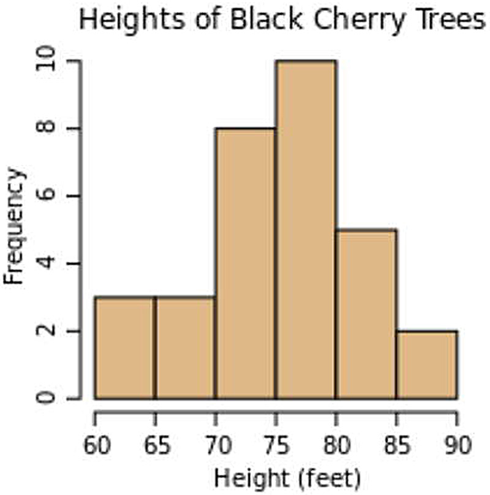
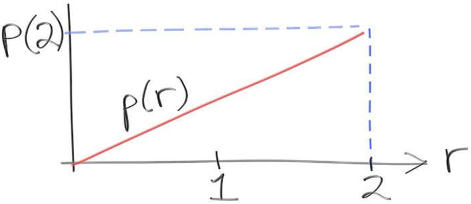
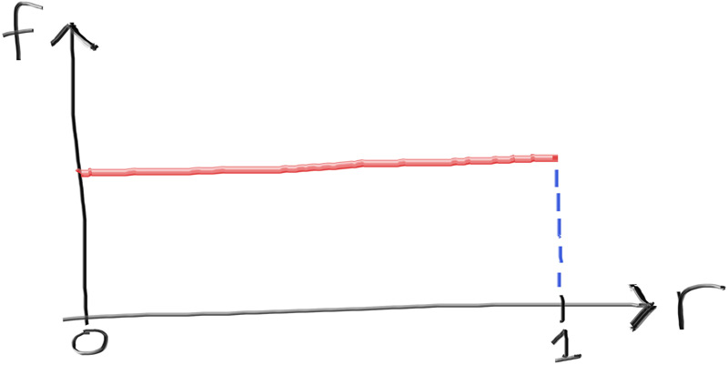
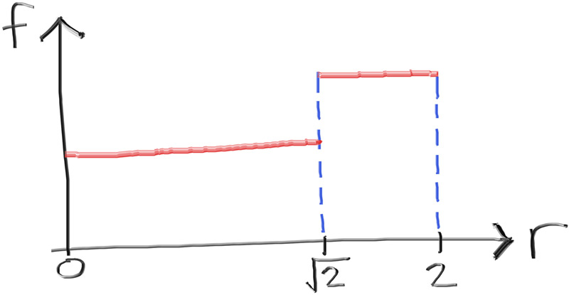
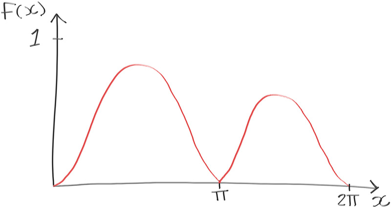

# 3 一维蒙特卡洛积分
我们对布丰投针问题的变体，是通过求解圆面积与外接正方形面积之比来计算π的一种方法。
$$
\frac{\text{area(circle)}}{\text{area(square)}} = \frac{\pi}{4}
$$
我们在外接正方形内随机选取大量点，统计其中同时落在单位圆内的点所占比例。该比例值会随着采样点增加而趋近于π/4。即便不知道圆的面积，我们仍可通过该比例关系求解：已知单位圆与外接正方形的面积比为π/4，且外接正方形面积为4r²，由此可推导出圆的面积为πr².
$$
\frac{\text{area(circle)}}{\text{area(square)}} = \frac{\pi}{4}
$$
$$
\frac{\text{area(circle)}}{(2r)^2} = \frac{\pi}{4}
$$
$$
\text{area(circle)} = \frac{\pi}{4} \times 4r^2
$$
$$
\text{area(circle)} = \pi r^2
$$
我们选择一个半径为 r=1 的圆，得到：
$$
\text{area(circle)} = \pi
$$
我们上述的工作在求解π和求解圆的面积方面同样有效。因此，我们可以在最初版本的圆周率程序中做如下替换：
```c++

    std::cout << "Estimated area of unit circle = " << (4.0 * inside_circle) / N << '\n';
    
```
## 3.1 期望值
让我们退一步，更广义地思考一下我们的蒙特卡洛算法。

假设我们具备以下所有条件
1.包含成员$x_i$的列表$X$
$$
X = (x₀, x₁, ..., x_{N-1})
$$
2.一个从列表中取元素的连续函数f(x)
$$
y_i = f(x_i)
$$
3.一个函数F(X)，它以列表X作为输入并生成列表Y作为输出
$$
Y = F(X)
$$
4.输出列表Y的成员为yi：
$$
Y = (y₀, y₁, ..., Y_{N-1}) = (f(x_0),f(x_1),...,f(x_{N-1}))
$$ 
如果我们假设以上所有条件成立，那么我们可以通过以下方式求解列表Y的算术平均数（即平均值）
$$
\begin{aligned}
\text{average}(Y_i) = \mathbb{E}[Y] &= \frac{1}{N}\sum_{i=0}^{N-1} y_i \\
&= \frac{1}{N}\sum_{i=0}^{N-1} f(x_i) \\
&= \mathbb{E}[F(X)]
\end{aligned}
$$

其中$E[Y]$被称为$Y$的期望值。

这里需要注意平均值（average value）与期望值（expected value）的微妙区别：

- 一个集合可以有许多不同的子集选择。每个子集都有一个平均值，即该子集中所有被选元素之和除以被选元素的数量。注意：特定元素在子集中可能出现零次、一次或多次。
  
- 一个集合只有一个期望值：集合中所有成员之和除以集合中元素的总数。换句话说，期望值就是集合所有成员的平均值。
  
需要重点指出的是：随着从集合中随机抽样次数的增加，集合的平均值将收敛于期望值。

若$x_i$的值是从连续区间$[a,b]$中随机选取的（即对所有$i$满足$a \leq x_i \leq b$），那么$E[F(X)]$将近似于连续函数$f(x')$在同一区间$a \leq x' \leq b$上的平均值。

期望值$E[f(x')|a \leq x' \leq b]$的近似计算可以表示为：
$$E[f(x')|a \leq x' \leq b] \approx E[F(X)|X=\{x_i|a \leq x_i \leq b\}]$$
$$\approx E[Y=\{y_i=f(x_i)|a \leq x_i \leq b\}]$$
$$\approx \frac{1}{N}\sum_{i=0}^{N-1}f(x_i)$$

当采样点数量$N$趋近于无穷大时，极限表达式为：
$$E[f(x')|a \leq x' \leq b] = \lim_{N \to \infty}\frac{1}{N}\sum_{i=0}^{N-1}f(x_i)$$

在连续区间$[a,b]$内，连续函数$f(x')$的期望值可以通过对区间内无限多个随机采样点求和来精确表示。当采样点数量趋近于无穷时，输出结果的平均值将收敛至精确解——这就是蒙特卡洛算法的核心原理。

除了随机采样外，我们还可以采用确定性采样策略来计算区间期望值。若在区间$[a,b]$内进行$N$次采样，可采用等间距布点方式：
$$x_i = a + i\Delta x$$
$$\Delta x = \frac{b-a}{N}$$

在求解期望值时：

$E[f(x')|a \leq x' \leq b] \approx \frac{1}{N}\sum_{i=0}^{N-1}f(x_i)\mid_{x_i=a+i\Delta x}$

$E[f(x')|a \leq x' \leq b] \approx \frac{\Delta x}{b-a}\sum_{i=0}^{N-1}f(x_i)\mid_{x_i=a+i\Delta x}$

$E[f(x')|a \leq x' \leq b] \approx \frac{1}{b-a}\sum_{i=0}^{N-1}f(x_i)\Delta x\mid_{x_i=a+i\Delta x}$

当$N$趋近于无穷大时取极限：

$E[f(x')|a \leq x' \leq b] = \lim_{N \to \infty} \frac{1}{b-a}\sum_{i=0}^{N-1}f(x_i)\Delta x\mid_{x_i=a+i\Delta x}$

这实际上就是一个常规积分：

$E[f(x')|a \leq x' \leq b] = \frac{1}{b-a}\int_{a}^{b}f(x)dx$

如果您还记得微积分入门课程的内容，函数的积分就是该区间内曲线下方的面积：

$\text{area}(f(x),a,b) = \int_{a}^{b}f(x)dx$

因此，区间上的平均值与该区间内曲线下方的面积有着本质联系：

$E[f(x)|a \leq x \leq b] = \frac{1}{b-a} \cdot \text{area}(f(x),a,b)$

函数的积分和该函数的蒙特卡洛采样都可以用来求解特定区间内的平均值。积分通过无限多个无穷小区间切片的求和来求解平均值，而蒙特卡洛算法则通过计算区间内不断增加的随机采样点的求和来近似相同的平均值。计算落在物体内部的点数并不是测量其平均值或面积的唯一方法。积分也是实现这一目的的常用数学工具。如果问题存在闭合形式，积分通常是最自然、最简洁的表达方式。

我认为几个例子会有助于理解。

## 3.2 求$x^2$的积分
让我们来看一个经典积分：

$I=\int_{0}^{2} x^2 dx$

我们可以用积分法求解：

$I=\left.\frac{1}{3}x^3\right|_{0}^{2}$

$I=\frac{1}{3}(2^3-0^3)$

$I=\frac{8}{3}$

或者，我们可以采用蒙特卡洛方法来求解这个积分。用计算机科学的表述方式，可以写成：

$I=area(x^2,0,2)$

也可以表示为：

$E[f(x)|a\leq x\leq b]=\frac{1}{b-a}\cdot area(f(x),a,b)$

$\text{average}(x^2,0,2)=\frac{1}{2-0}\cdot area(x^2,0,2)$

$\text{average}(x^2,0,2)=\frac{1}{2-0}\cdot I$

$I=2\cdot \text{average}(x^2,0,2)$

蒙特卡洛方法的实现步骤：
```c++
#include "rtweekend.h"

#include <iostream>
#include <iomanip>

int main() {
    int a = 0;
    int b = 2;
    int N = 1000000;
    auto sum = 0.0;

    for (int i = 0; i < N; i++) {
        auto x = random_double(a, b);
        sum += x*x;
    }

    std::cout << std::fixed << std::setprecision(12);
    std::cout << "I = " << (b - a) * (sum / N) << '\n';
}
```
不出所料，这种方法得出的结果与我们通过积分获得的精确解几乎一致，即$I=2.666...=\frac{8}{3}$。你可能会针对这个例子指出：积分运算的工作量其实远小于蒙特卡洛方法。对于函数$f(x)=x^2$的情况确实如此，但存在许多函数（例如$f(x)=\sin^5(x)$）用蒙特卡洛方法求解可能比积分运算更简便。

```c++
for (int i = 0; i < N; i++) {
        auto x = random_double(a, b);
        sum += std::pow(std::sin(x), 5.0);
}
```
我们也可以对不存在解析积分的函数使用蒙特卡洛算法，例如函数$f(x)=\ln(\sin x)$。


```c++
for (int i = 0; i < N; i++) {
    auto x = random_double(a, b);
    sum += std::log(std::sin(x));
}
```
在图形学中，我们经常会遇到以下情况：有些函数虽然可以显式写出，但其解析积分过程极其复杂；同样常见的是，有些函数虽可求值却无法显式表达；更常见的情形是，我们只能通过概率方式对函数进行评估。前两本书中提到的`ray_color`函数就是典型示例——我们无法确定从空间任意位置所有方向可见的颜色，但可以通过统计方法估算从特定位置沿单一方向观察到的颜色。

## 3.4 密度函数
我们在前两本书中编写的ray_color函数虽然简洁优雅，却存在一个重大缺陷——小光源会产生过多噪点。这是因为均匀采样无法充分捕捉这些光源：只有当光线恰好散射向光源时才会被采样，但对于微小或遥远的光源而言，这种概率极低。当背景设为黑色时，场景中唯一的光照就来自人工布置的光源。设想表面相邻两点分别射出两条光线：一条随机反射向光源会呈现亮色，另一条反射向其他方向则呈现暗色。实际上，两者的亮度本应处于中间值。

若强行将所有光线导向光源虽能缓解问题，却会导致场景整体过亮。常规光线追踪是从相机出发经场景最终抵达光源，但逆向思考：若从光源出发经场景反射最终到达相机，这条光线初始明亮，每次反射都会衰减能量，最终抵达相机时已因多次反射而变得暗淡且着色。如果强制光线首次反射就直奔相机，就会因缺少衰减过程而导致异常明亮——这与过度采样光源的效果类似：虽然能解决相邻像素明暗不均的问题，却会导致所有像素整体过亮。

通过降权处理这些过采样样本可以消除失真。要实现这种调整，首先需要理解概率密度函数（PDF）的概念，而理解PDF又需要先掌握密度函数的本质。

密度函数本质上是直方图的连续版本。这里引用维基百科直方图条目的示例说明：（此处可插入直方图示例说明）

若数据源中的条目增多，分箱数量保持不变，但每个箱内条目频率会升高。若将数据划分为更多箱体，箱数会增加，但每个箱内条目频率会降低。若将分箱数量趋近于无限，则会出现无数个零频率箱体。为解决此问题，我们将用离散密度函数替代原有的离散函数——直方图。离散密度函数与离散函数的区别在于：其纵轴标准化为总量占比（即密度），而非各箱的绝对计数。从离散函数转换为离散密度函数非常简单：

$$
\text{箱体i的密度} = \frac{\text{箱体i中的条目数}}{\text{总条目数}}
$$

获得离散密度函数后，通过将离散值转为连续值，可进一步转化为密度函数：

$$
\text{箱体密度} = \frac{\text{高度介于H与H′之间的树木占比}}{(H-H′)}
$$

因此，密度函数即是所有数值都经过总量标准化的连续直方图。若需了解某特定树木的高度，可构建概率函数来预测该树木落入特定箱体的可能性：

$$
\text{箱体i的概率} = \frac{\text{箱体i中的条目数}}{\text{总条目数}}
$$

将概率函数与（连续）密度函数结合，即可作为树木高度的统计预测器：

$$
\text{随机树木高度介于H与H′之间的概率} = \text{箱体密度} \cdot (H-H′)
$$

实际上，通过这个连续概率函数，我们现在能计算任意树木高度落在多个箱体任意跨度区间内的可能性。这就是概率密度函数（简称PDF）。简言之，PDF是一种连续函数，可通过积分确定结果在区间内出现的概率。

## 3.4 构造一个概率密度函数

让我们创建一个PDF（概率密度函数）并通过实践来建立直观理解。我们将使用以下函数：


这个函数的作用是什么？我们知道概率密度函数（PDF）就是一个连续函数，它定义了任意数值范围出现的可能性。这个函数$p(r)$的定义域被限制在$[0,2]$区间内，并在该区间内呈线性增长。因此，如果我们用这个函数作为PDF来生成随机数，那么得到接近零的数值的概率会小于得到接近二的数值的概率。

这个PDF函数$p(r)$是一个线性函数，在$r=0$处从$0$开始单调递增，在$r=2$处达到最高点$p(2)$。那么$p(2)$的值是多少？$p(r)$的值又是多少？也许$p(2)$等于2？既然PDF从0到2线性增长，猜测$p(2)$的值为2似乎是合理的。至少看起来它不可能是0。

请记住，PDF是一个概率函数。我们将PDF限制在$[0,2]$范围内。PDF表示概率列表的连续密度函数。如果我们知道列表中的所有内容都包含在0到2之间，就可以说获得0到2之间值的概率是100%。因此，曲线下的面积总和必须等于1：

$$
\text{area}(p(r),0,2)=1
$$

所有线性函数都可以表示为常数乘以变量的形式：

$$
p(r)=C \cdot r
$$

我们需要求解常数$C$的值。可以通过积分反向推导：

$$
1 = \text{area}(p(r),0,2) = \int_{0}^{2} C \cdot r \, dr = C \cdot \int_{0}^{2} r \, dr = C \cdot \left. \frac{r^2}{2} \right|_{0}^{2} = C \left( \frac{2^2}{2} - \frac{0}{2} \right)
$$

解得：

$$
C = \frac{1}{2}
$$

因此我们得到PDF函数：

$$
p(r) = \frac{r}{2}
$$

就像处理直方图一样，我们可以对区域求和（积分）来计算$r$落在某个区间$[x_0,x_1]$内的概率：

$$
\text{Probability}(r \mid x_0 \leq r \leq x_1) = \text{area}(p(r),x_0,x_1) = \int_{x_0}^{x_1} \frac{r}{2} \, dr
$$

为了验证理解，你可以对$r=0$到$r=2$的区域进行积分，应该得到概率值为1。

在研究PDF足够长时间后，你可能会开始将PDF称为变量$r$等于某个值$x$的概率，即$p(r=x)$。但不要这样做。对于连续函数来说，变量等于特定值的概率始终为零。PDF只能告诉你变量落在给定区间内的概率。如果你检查的区间是单个值，那么PDF总是返回零概率，因为它的"区间"无限薄（宽度为零）。这里有一个简单的数学证明：

$$
\text{Probability}(r=x) = \int_{x}^{x} p(r) \, dr = P(r) \Big|_{x}^{x} = P(x) - P(x) = 0
$$

而围绕$x$的某个区域的概率可能不为零：

$$
\text{Probability}(r \mid x-\Delta x < r < x+\Delta x) = \text{area}(p(r),x-\Delta x,x+\Delta x) = P(x+\Delta x) - P(x-\Delta x)
$$

## 3.5 选择我们的样本
如果我们掌握了目标函数的概率密度函数（PDF），就能确定该函数在任意区间内返回值的概率。这一特性可被用于指导采样位置的选取。回想最初的目标：寻找最佳采样方式以避免场景中出现明暗像素剧烈相邻的现象。若拥有场景的PDF，我们就能以概率方式将样本导向光照区域，同时避免图像出现不自然的过亮现象。前文已指出，若简单地将样本导向光照区域会导致图像亮度失真。现在需要解决的，是如何在不引入失真的前提下实现样本导向——这个问题稍后会详细说明，当前我们聚焦于已知PDF时的样本生成方法。

如何根据PDF生成随机数？这需要引入更多数学工具。别担心——过程不会太复杂！

我们的随机数生成器random_double()会产生$[0,1]$区间内均匀分布的随机双精度浮点数。对于均匀分布在$[0,10]$区间的PDF，只需简单地将random_double()的输出乘以10即可获得完美的采样样本：
$$ \text{sample} = 10 \times \text{random\_double()} $$

这是一个简单的例子，但我们需要处理的大多数情况都是非均匀分布的。我们需要找到一种方法，将均匀随机数生成器转换为非均匀随机数生成器，其分布由概率密度函数（PDF）定义。我们假设存在一个函数$f(d)$，它能接收均匀分布的输入并生成由PDF加权的非均匀分布。现在只需找到求解$f(d)$的方法。

对于上述给定的PDF，其中$p(r)=r^2$，随机样本在接近2时的概率高于接近0时的概率。在1.8到2.0之间获取数字的概率比在0.0到0.2之间更高。如果我们暂时放下数学思维，换上计算机科学的视角，或许能找到一种巧妙的分割PDF的方法。我们知道在接近2处的概率高于接近0处，但哪个值能将概率均分为两半？即随机数有50%的概率高于该值，50%的概率低于该值的$x$是多少？我们需要解以下方程：

$$50\% = \int_0^x r^2 \, dr = \int_x^2 r^2 \, dr$$

求解得到：

$$0.5 = \left. \frac{r^2}{4} \right|_0^x$$
$$0.5 = \frac{x^2}{4}$$
$$x^2 = 2$$
$$x = \sqrt{2}$$

作为一种粗略的近似，我们可以创建一个函数$f(d)$，其输入为`double d = random_double()`。如果$d$小于（或等于）0.5，它生成$[0, \sqrt{2}]$范围内的均匀数；如果$d$大于0.5，则生成$[\sqrt{2}, 2]$范围内的均匀数。
```c++
double f(double d)
{
    if (d <= 0.5)
        return std::sqrt(2.0) * random_double();
    else
        return std::sqrt(2.0) + (2 - std::sqrt(2.0)) * random_double();
}
```
虽然我们最初的随机数生成器在0到1之间是均匀分布的:

我们对$r_2$的新粗略近似是非均匀的（但仅此而已）：


我们已有上述积分的解析解，因此可以轻松求出50%分位值。但也可以通过实验方法求解这个50%分位值。有些函数的积分可能无法求解或我们不愿求解，此时可以通过实验获得接近真实值的结果。以如下函数为例：

$p(x)=\frac{e^{-x}}{\sqrt{2\pi}}\sin^2(x)$

其函数图像大致如下所示：

此时，您应该已经熟悉如何通过实验方法求解曲线下面积。我们将对现有代码稍作修改，以估算出对应50%面积时的$x$值。我们的目标是找到使曲线下面积为总面积一半的$x$值。在计算$N$个样本的滚动求和过程中，我们会同时存储每个样本点及其对应的概率密度值$p(x)$。求得总和后，我们将对样本进行排序并累加，直到获得相当于总面积一半的区域。以区间$[0, 2\pi]$为例：

```c++
#include "rtweekend.h"

#include <algorithm>
#include <vector>
#include <iostream>
#include <iomanip>

struct sample {
    double x;
    double p_x;
};

bool compare_by_x(const sample& a, const sample& b) {
    return a.x < b.x;
}

int main() {
    const unsigned int N = 10000;
    sample samples[N];
    double sum = 0.0;

    // Iterate through all of our samples.

    for (unsigned int i = 0; i < N; i++) {
        // Get the area under the curve.
        auto x = random_double(0, 2*pi);
        auto sin_x = std::sin(x);
        auto p_x = exp(-x / (2*pi)) * sin_x * sin_x;
        sum += p_x;

        // Store this sample.
        sample this_sample = {x, p_x};
        samples[i] = this_sample;
    }

    // Sort the samples by x.
    std::sort(std::begin(samples), std::end(samples), compare_by_x);

    // Find out the sample at which we have half of our area.
    double half_sum = sum / 2.0;
    double halfway_point = 0.0;
    double accum = 0.0;
    for (unsigned int i = 0; i < N; i++){
        accum += samples[i].p_x;
        if (accum >= half_sum) {
            halfway_point = samples[i].x;
            break;
        }
    }

    std::cout << std::fixed << std::setprecision(12);
    std::cout << "Average = " << sum / N << '\n';
    std::cout << "Area under curve = " << 2 * pi * sum / N << '\n';
    std::cout << "Halfway = " << halfway_point << '\n';
}
```
这段代码与我们之前看到的没有太大区别。我们仍在求解区间（$0$ 到 $2\pi$）上的总和。不同的是，这次我们还存储并按输入和输出对所有样本进行了排序。利用这些数据，我们确定样本累积和达到整个区间总和一半的位置。当我们发现前 $j$ 个样本的和等于总和的一半时，就可以确定第 $j$ 个样本的 $x$ 值大致对应着中点位置：
Average = 0.312041960134
Area under curve = 1.960617459139
Halfway = 2.026394769180
如果你对从$0$到$2.026$和从$2.026$到$2\pi$的积分进行求解，两者的结果应该几乎完全相同。

我们有一种方法可以求解概率密度函数（PDF）的中分点，从而将其分成两半。如果需要，我们可以利用这一点创建PDF的嵌套二分分区：

1. 求解PDF的中分点  
2. 递归处理下半部分，重复步骤1  
3. 递归处理上半部分，重复步骤1  

在合理的深度（比如6到10层）停止递归。可以想象，这种方法的计算成本可能相当高。上述代码的计算瓶颈可能在于样本排序——朴素的排序算法时间复杂度可能达到$O(n^2)$，代价极其高昂。幸运的是，标准库内置的排序算法通常更接近$O(n\log n)$时间复杂度，但对于数百万甚至数十亿样本而言，这仍然相当耗时。不过，这种方法能生成效果尚可的非均匀分布数值。

这种通过分治法生成非均匀分布的方式在实践中较为常见，但相比简单的二分分区，还存在更高效的实现方法。如果你想将任意函数作为分布的PDF使用，建议研究**Metropolis-Hastings算法**。